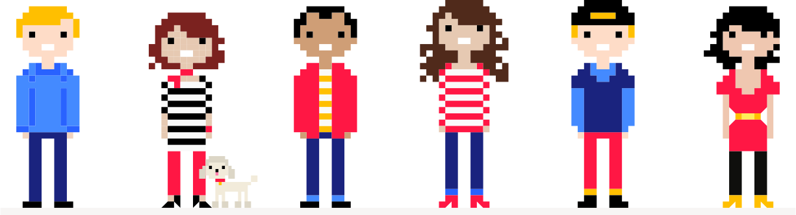

 # Welcome to NFT School

What does it mean to own a piece of the internet? Can you sell a meme to the highest bidder? Is the metaverse finally happening? Let's find out together!

**Welcome to NFT School, a collective of web developers and technology enthusiasts here to figure out what's going on with non-fungible tokens, or NFTs.** In the past few years, NFTs have gone from a niche concern within the blockchain world to a cultural phenomenon that has captured the imagination of artists, technologists, and the mass media.

As builders, we'll be exploring NFTs from the technical side, taking them apart, and seeing how they work. We'll also take a look at some of the use cases for NFTs, so that we can help build new experiences around them.

We'll be building on a background of modern web development, with a focus on JavaScript. Along the way, we'll get familiar with the core technologies that make NFTs possible, like smart contracts and content-addressed storage. If you're a newcomer to the space and find yourself confused, we want to know about it! Please [open an issue](https://github.com/protocol/nft-website/issues/new?assignees=&labels=need%2Ftriage&template=open-an-issue.md&title=%5BCLARIFICATION+NEEDED%5D+%28add+your+title+here%21%29) with any suggestions for how to make this content more accessible.

 ## Quick start

**NFT School is a growing work-in-progress, so check back frequently for new content!** To get started right away, try these top items:

- [**NFT Basics**](./concepts/non-fungible-tokens.md) is a high-level overview of just what an NFT is exactly, and what they're being used for.
- Our [**First Steps Tutorial**](./tutorial/first-steps.md) helps you get set up to interact with smart contracts on Ethereum, before we get into the specifics of NFTs themselves.
- In the [**Minting Service Tutorial**](./tutorial/minting-service.md), we examine a simple NFT minting app to see exactly how the process works — from storing images on IPFS to creating tokens on Ethereum.

 ## Contribute to NFT School

 NFT School is an [open-source project](https://github.com/protocol/nft-website/) that welcomes contributors of all specialties from all over the world!

 Are you a great communicator who'd like to make the global NFT developer community better? **Share your knowledge with your peers** and contribute a tutorial, how-to, or concept guide to this open-source site. See what existing [content request issues](https://github.com/protocol/nft-website/issues?q=is%3Aissue+is%3Aopen+label%3Atopic%2Fdesign-content) are looking for writers, or if you'd like to add something completely new, [open an issue](https://github.com/protocol/nft-website/issues/new?assignees=&labels=need%2Ftriage&template=content-or-feature-suggestion.md&title=%5BCONTENT+REQUEST%5D+%28add+your+title+here%21%29) to suggest new content. (And thank you in advance!)
