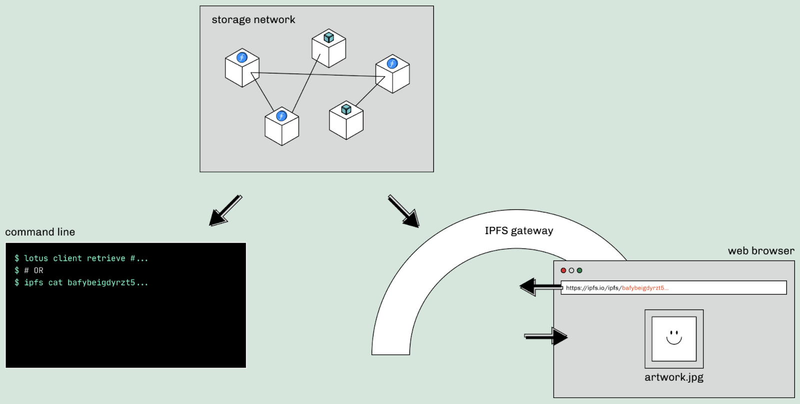

# Content persistence

Broadly speaking, today's web browsing operates through what is known as _location addressing_. Location addressing retrieves online information from specific locations on the web ─ i.e. from behind URLs. However, this has its obvious downsides. Location addressing is _centralized_, which means that whoever controls that location controls the content. And anything behind a location-addressed URL can be changed: the language of an article, the colors used in a digital artwork, or the properties of a recorded identity. In short, **location-addressed URLs are exploitable**.

The solution to this problem starts with [_content addressing_](./content-addressing.md). Content-based addressing allows you to access data based on a unique fingerprint (often called a [_hash_](https://docs.ipfs.io/concepts/hashing/)) of that piece of data; no matter where it is stored, if you have that unique fingerprint of the data, you should be able to retrieve the content. This means that if you use content-addressed storage — in particular [IPFS](https://ipfs.io), which you'll see referred to throughout NFT School — your content is no longer retrieved from single locations on the web. Instead, when someone requests that piece of content, it is retrieved from any participating nodes on the IPFS network that have a copy of it. Pieces of content can be located on many nodes, and content can be retrieved either entirely from one node or assembled in bits and pieces from multiple nodes.

Content addressing, however, is only part of the solution. Just because data can be retrieved through IPFS no matter where it is stored, this doesn't mean that data is guaranteed to be around forever. **To have a complete solution, content persistence is key.**

## Why content persistence

Once we reorient the retrieval of online content around content-based addressing, the question becomes: **How do we ensure that content continues to be available throughout time?** In other words, how do we make sure the content _persists_? Without content that is reliably stored over time, even a content-addressed web suffers similar dangers to today; unless content persists, we run the risk of a fragmented, incomplete, and amnesic web.

As with most solutions in the data and information space, there are centralized and decentralized options for solving content persistence. The centralized option would be to go with a service that promises to always store the content on their servers. Centralized storage, however, doesn't achieve true persistence, as it is subject to a single centralized point of failure.

The other option, _decentralized content persistence_, is the only way to ensure that content remains available over time. Using completely separate, interoperable nodes to store data that is backed by strong cryptographic guarantees protects information from becoming unavailable due to the action (or inaction!) of any centralized service. How can this be done? [Filecoin](https://filecoin.io) is leading the way in this space by building the foundation for content persistence, as well as creating a set of tools and services on top that can aid in that mission.

## Filecoin for content persistence

Using Filecoin with IPFS provides a complete solution by combining an incentivization layer for content persistence with IPFS' solution to content addressing. IPFS ensures that content cannot change over time without a clear audit trail — thus solving the issue of URLs not resolving. Filecoin ensures that the content-based addressing provided by IPFS remains resilient over time by making sure that content remains available for retrieval.

Filecoin achieves this mission through [novel cryptography, consensus protocols, and game-theoretic incentives](https://filecoin.io/blog/posts/filecoin-features-verifiable-storage/) — in short, true decentralized storage for data stored on the Filecoin network. At the heart of it all is Filecoin's unique approach to storage verification.

Filecoin's storage verification system solves a previously intractable problem for decentralized storage: How can storage providers _prove_ that they are really storing the data they say they are through time and that they are dedicating unique physical space to it?

With those centralized storage providers we mentioned earlier, users place their trust in well-known companies that guarantee the integrity and security of their systems. On the Filecoin network, anyone in the world can offer storage space. To maintain trust on a decentralized network like Filecoin, you need a way to establish trust in the network itself. To that end, anyone who wants to offer verified storage on Filecoin's decentralized network needs to prove two things — first, that the right set of data is stored in a given storage space, and second, that the same set of data has been stored continuously over a given period of time.

Filecoin's [proving algorithms](https://filecoin.io/blog/posts/what-sets-us-apart-filecoin-s-proof-system/) take care of this verification. _Proof-of-Replication_ proves that a given storage provider is storing a physically unique copy of a client's original data, while _Proof-of-Spacetime_ proves that the client's data is stored continuously over time.

In addition to this proof system, the Filecoin network also relies on game-theoretic incentives to discourage malicious or negligent activity. All Filecoin storage providers must provide collateral in the form of Filecoin tokens (FIL) at the time of agreeing to become providers. Any storage provider that fails Proof-of-Spacetime checks is penalized, loses a portion of their collateral, and is eventually prevented from offering storage to clients again.

The Filecoin network continues to grow, providing rapidly increasing capacity for content-persistent, content-addressed storage. You can see the latest high-level storage metrics, as well as additional Filecoin data and a blockchain explorer, on [Filfox](https://filfox.info/en).

## How NFTs benefit

NFTs are one of the fastest growing spaces in crypto today — however, NFTs have particularly been the subject of scrutiny when it comes to availability and permanence. 

When we talk about "minting an NFT" or "trading an NFT", what we're often referring to isn't the creative work itself, but rather _the record of_ the work — in other words, not the _content_ (the colors, shapes, or sounds that make up the work), but the _metadata_ (such as descriptive text, artist information, or a pointer to the location of the content itself). However, neither that content nor that data automatically live on the blockchain. This exposes many NFTs to issues of addressing availability and persistence if their content and metadata are not stored reliably. Using IPFS to solve the addressing concern of NFTs is quickly becoming the norm, and a large and growing ecosystem of [_pinning services_](https://docs.ipfs.io/concepts/persistence/#pinning-services) helps ensures availability of IPFS data.

Specific to the NFT space, [nft.storage](https://nft.storage/) is a free service designed to make handling content addressing and persistence as easy as possible. The service allows anyone to generate the metadata for minting and storing NFTs on Filecoin for free with only a few lines of code. Developers register for an account, generate an API access key, and can use a simple client library to generate metadata and permanently store their NFTs.

Using the Filecoin + IPFS methodology outlined above, NFTs stored via nft.storage are not only available through the IPFS network, but are also protected from disappearing by Filecoin's incentivizing its global network of storage providers to continue storing that NFT content and metadata long-term.

## Future evolution

Right now, agreements to keep content stored over time are economic relationships between individuals and the nodes that keep the content online. The model has proven immensely sustainable for the Filecoin ecosystem. However, the ecosystem is also preparing for greater numbers of people who want to store their information on Filecoin, and creating solutions to accommodate more decentralized means of ownership and payment. The nft.storage service is one example of this: By providing storage for developers of NFT applications, nft.storage is also encouraging NFT best practices by making them as easy as possible to implement and by removing the economic consideration from creators and collectors.

As time goes on, even more ecosystem players will emerge to incentivize the persistence of vital data, adopting different economic roles within the IPFS/Filecoin ecosystem and making the basic relationship between individual and storage providers more varied, flexible, and sustainable. One example on the horizon is [DataDAOs](https://filecoin.io/blog/posts/the-future-of-datadaos/), a type of _decentralized autonomous organization_ dedicated to the storage, maintenance, processing, and possibly licensing of potentially massive datasets. DataDAOs are well positioned to shape the evolution of data storage and payment on distributed systems; by shouldering the technical and financial responsibility of storing big datasets, they can effectively monetize critical data while remaining true to a broader commitment to decentralized content persistence. Others, like [Ocean Protocol](https://oceanprotocol.com/) and [Filehive](https://filecoin.io/blog/posts/decentralized-data-markets-with-filehive/), do not operate as DAOs, but play a similar role as ecosystem players that rely on Filecoin to maintain the data they are monetizing and licensing to others.
