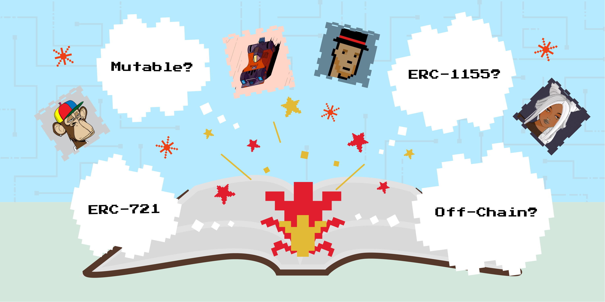

# Introduction

Ever since Non-Fungible Tokens (NFTs) entered onto the cultural scene back in March of 2021, they have been plagued by confusion and misunderstanding. Particular types of NFTs—such as the well-known (and well-critiqued) Bored Ape Yacht Club—led many people to develop a narrow and distorted view of what is actually a very broad and interesting piece of technology. 

The uses cases and methods of implementing NFTs are endless, but the cultural understanding is currently stuck. Furthermore, if a person is curious enough to look beyond the surface, they might be hard-pressed to navigate what’s underneath. Because of this, we have created the Encyclopedia of NFTs — it is our hope that the following resource will help interested explorers begin to grasp what NFTs as a technology actually has to offer. 

The first half of this guide explains the jargon associated with NFTs as well as gives a broad overview of the landscape and industry. After reading, you’ll have a basic understanding of the different ways you could interact with the world of NFTs. From there, the second half will help you actually begin to navigate decision-making if you’re considering collecting or making NFTs yourself. This guide is not exhaustive by any means, but it should provide you with a robust foundation to build upon.

Let’s dive right in!

## What is an NFT?

To begin, it’s important to understand what a Non-Fungible Token is at a high level. Technically speaking, **an NFT is not a picture of an ape or a pixelated punk rocker; it’s actually a unique numerical identifier governed by a smart contract that can have other data and information associated with it (such as a picture of an ape or pixelated punk rocker).** 

If that sounds a little fuzzy, take a moment to ask yourself, “what is a computer file?”. Most people interact with files on their laptops or smart phones every single day, but they’d be hard-pressed to articulate what exactly those files are made of. Trying to understand a non-fungible token is quite similar. In some ways, a non-fungible token is like a computer file but the file isn’t stored on a single device… it’s stored on a decentralized virtual computer that thousands of people all over the world help operate. 

In a similar fashion to how computer files come in several formats such as .jpg or .txt, NFTs also can come in several different formats called **Standards**.

[Continue to Standards section](/encyclopedia/part-1/standards)
