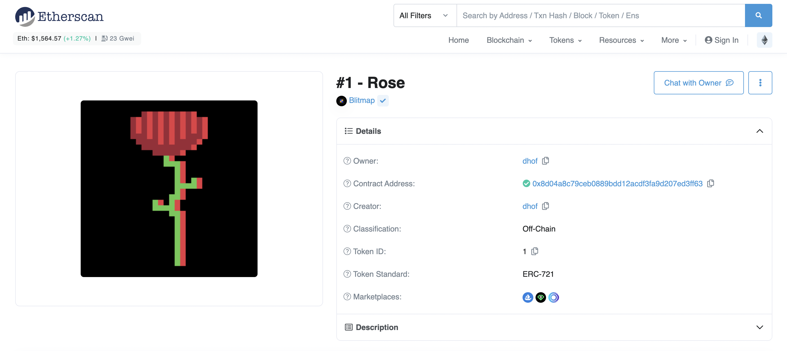

# Components

> A component is one of the different elements that make up the technical underpinnings of an NFT.

## Smart Contract
A piece of software with rules, data, and functions that is deployed permanently on the blockchain. A smart contract is used to generate NFTs, and it dictates how the NFTs created with the contract will function and exist.

## Token ID
Each NFT minted on a contract will have a unique token ID number that distinguishes it from all the other NFTs in the collection. Often token IDs will start at 0 or 1 and count upwards, but they can also be configured in many other ways. With ERC-1155 NFTs, each single edition of an NFT won’t have a distinct token ID, but each batch of editions will. For instance, you could own 2 editions of Token ID #4, but your two editions won’t have unique IDs; you would merely own 2 copies of Token ID #4.

## Metadata
On a basic level, metadata defines and controls a large portion of how most NFTs work. Metadata for an NFT is typically a simple string of text formatted in a special way. It defines things like the media/image URL, the name, the creator, the description, the traits, etc. 

## Media
If an NFT has a media component such as an image or a song, that asset must be hosted somewhere and referenced within the metadata. Due to the expectation for permanence and censorship-resistance from the NFT market, self-hosting an NFT’s media component or hosting with a centralized entity like AWS is considered a very bad practice. Hosting with a decentralized storage solution like [NFT.storage](http://NFT.storage) (powered by IPFS + Filecoin) is the best way to go.

## Owner
The wallet address that currently possesses the NFT, as shown on the blockchain itself.

## Creator/Minter
The wallet address responsible for minting the NFT from the smart contract.

Below is an example of what the metadata for Token ID 1 from the Blitmap collection actually looks, followed by how the Token is displayed on Etherscan.

`{"image":"https://api.blitmap.com/v1/png/1","name":"#1 - Rose","description":"Blitmap is a community crafted art collection and universe. All data is completely on chain.\n\n[blitmap.com](https://www.blitmap.com)","attributes":[{"trait_type":"Type","value":"Original"},{"trait_type":"Composition","value":"Rose (#1)"},{"trait_type":"Palette","value":"Rose (#1)"},{"trait_type":"Affinity","value":"Fire III"},{"trait_type":"Slabs","value":"◢ ◢ ◢ ◥"},{"trait_type":"Attunement","value":"Attuned"}]}`

[Continue to next section](/encyclopedia/part-2/choosing-a-standard)
