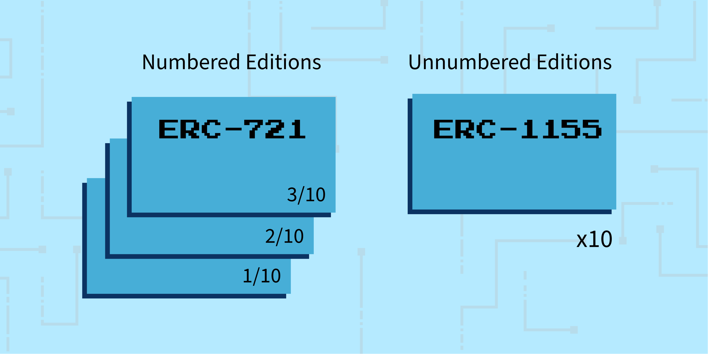

# Types

> A **type** is a particular quality, attribute, or trait of an NFT. An NFT can have multiple **types**. For instance, an NFT could be a mutable multi-edition generative art piece that is stored off-chain but was not pre-minted. Think of types as different flavors that can be mixed and combined together to achieve different results.

## Purpose Types
On the highest level, NFTs can be categorized as either utility-focused or art-focused. This is an NFT’s designed “purpose”. An NFT can be both utilitarian and decorative, but there’s often an emphasis on one more than the other. Furthermore, an art-focused NFT could have utility added to it after the fact. It may be helpful to think of purpose types as a fluid spectrum.

- **Utilitarian** - An NFT that enables a practical use case in the lives of its users or owners. Possession of a utilitarian NFT might grant the holder access to exclusive content, benefits, or even rewards. A common example of a utilitarian NFT would be an event ticket or a membership card. A graphic or artistic visual is often used to represent a utilitarian NFT, but the visual component would typically be secondary in nature.

- **Art, Decorative, or Collectible** - An NFT that represents a work of art or some other thing that is primarily appreciated for its aesthetic or conceptual qualities. An art NFT could also enable or bestow utilitarian benefits upon the owner if the creator so desired, but the utility would typically be secondary in nature.

## Quantity & Supply Types
While the purest definition of an NFT implies complete uniqueness of each item, the reality is a lot more nuanced. Fungibility is actually a spectrum, and NFTs are flexible enough to be used in a variety of ways to implement quantities and supply sizes.

- **One-of-one** - Perhaps the most basic of NFT types, a one-of-one refers to completely unique and distinct objects or art pieces. There is only one NFT of it, and typically no other versions exist.

- **Multi-edition** - In contrast to a one-of-one, a multi-edition NFT is when there are multiples of the same object or piece of art. There are several ways of implementing multi-edition NFTs, but the most common approach is to either use an ERC-721 contract or an ERC-1155 contract. Depending on which you choose, the outcome will be slightly different. When you use an ERC-721 contract, each NFT within an edition has a distinct identifier and could be numbered like so: “Artwork B 1/10”, “Artwork B 2/10”, “Artwork B 3/10”, etc. In this scenario, the owner of “Artwork B 5/10” is the only person who owns “Number 5”. This method would be comparable to a photographer or screen printer creating a limited run of 10 signed and numbered prints in the physical world. 

  When you use an ERC-1155 contract on the other hand, you are able to create semi-fungible quantities of each object or work of art. In the example of “Artwork B”, the ERC-1155 version would not have distinct identifiers or numbers for each piece within the edition. There would simply be 10 editions of “Artwork B”, but there would be no specific “Number 5” or “Number 3”. All of the items within the edition would be identical and interchangeable for any of the other items within that edition. This method would be comparable to a photographer or screen printer creating a limited run of 10 signed prints in the physical world, but each print would not be numbered.

  

- **Open-edition** - An open-edition is a multi-edition where someone creates an uncapped supply of a particular object or work of art. The number of editions created will match the number of editions sold. Often times, an artist will choose to create an edition that remains open until a fixed point in time or until a certain criteria has been met. A basic example of this would be a work of art being sold as an open edition for 48 hours. Within this set time frame, there is no limit on the number of editions that can be sold.

- **Limited-edition** - A limited-edition is the more traditional form of an edition. This type would be comparable to our earlier example of a photographer or screen printer creating a limited run of 10 signed and numbered prints in the physical world. The limit creates scarcity which can have an impact on market dynamics such as pricing and demand.

- **Collection** - Most NFT platforms, protocols, and markets will categorize all the NFTs made from a single smart contract as being a part of one “collection”. There are many ways to organize and structure a collection, including using metadata called properties/traits, and it often will have an impact on supply & quantity dynamics. If the way your NFTs are perceived by the general public on various web3 platforms matters to you, then it will be important to think about your NFTs within the framework of “collections”.  

  - **Open collection size** - Similar to the concept of editions, a collection can be “open” when it comes to the number of NFTs within it. With an open collection, generally there is no declared limited on the number of NFTs within the collection. Fine artists have been known to create a single smart contract that they regularly mint their new work on rather than having multiple different contracts. In this scenario, they may choose to organize the collection further by using metadata (i.e. sorting a photography collection by focal length or camera body used).

  - **Fixed collection size** - A fixed collection means that either A) the creator has promised not to create more than a certain number of NFTs within the collection, or B) the smart contract itself dictates a limited supply size. The CryptoPunks collection is an example of a fixed collection size, as it has a maximum number of 10,000 NFTs within it. Alternatively, the fixed nature of a collection might be time-bound instead of quantity bound.

  - **Properties/Traits** - While not necessary or present in all projects, many NFTs have metadata that define properties or traits within a collection. For instance, the CryptoPunks collection has dozens of traits and combinations that help make each CryptoPunk different: alien, beanie, red mohawk, nerd glasses, etc. Traits can come in many different forms, but the important thing to remember is how they can impact the perception of rarity, quantity, and supply. The CryptoPunks collection is 10,000 different pixelated punks (no two are identical), but the total supply of alien punks is limited to just 9.

  )](../../images/encyclopedia/collection.png)
  *An example of what a collection page looks like on the NFT marketplace OpenSea. ([Source](https://opensea.io/collection/fidenza-by-tyler-hobbs))*

## Data Storage Types
When it comes to storing the media associated with an NFT, there are a lot of options and each one has different upsides and downsides. Many people have thought about NFT media as being stored either “on-chain” or “off-chain”, but the reality is a lot more complicated. “On-chain” and “Off-chain” looks more like a spectrum, with most NFTs not falling entirely on either extreme. For the purposes of this guide, we’ll stick to defining the two terms on a high level. Lastly, storage choice for NFT media has many technical implications, but it can also have cultural implications. For instance, different people and communities can have different preferences when it comes to data storage.

- **On-chain** - An “on-chain” NFT refers to an NFT which has a significant amount of its data encoded directly onto the blockchain. In the case of the Ethereum blockchain, data storage and processing costs can be extremely high due to the security and permanence of Ethereum records. This dynamic creates lots of limitations with the amount of data that can be stored. For this reason, many NFTs store only a minimal amount of their data on-chain. “On-chain” NFTs in general are often perceived as being more censorship resistant, permanent, and secure when compared to “off-chain” alternatives. That being said, the vast majority of NFTs are more “off-chain” than they are “on-chain”.

- **Off-chain** - An “off-chain” NFT refers to an NFT which has a significant amount of its data stored outside of the blockchain itself. In many cases, an NFT might have a minimal amount of metadata stored on-chain that then links back to the rest of the data which is stored “off-chain” in a more flexible or cost efficient location such as IPFS or Filecoin.

   offers free decentralized storage for NFTs via IPFS and Filecoin.](../../images/encyclopedia/nftstorage.png)
  *[NFT.Storage](http://NFT.Storage) offers free decentralized storage for NFTs via IPFS and Filecoin.*

## Change/State Types
The vast majority of NFTs and traditional media in the world are relatively fixed and static, meaning they’re not really supposed to change over time after the point of creation. That being said, there are many different types of “states” and an NFT doesn’t have to be unchangeable.

- **Interactive** - An interactive NFT is one that can be changed or manipulated by some person, group, or entity. For example, an NFT could be a character in a game that can be upgradeable or customized by the owner or user.

- **Non-interactive** - A non-interactive NFT is one that cannot be changed or manipulated. For example, most traditional fine-art NFTs are meant for viewing pleasure and have no ability to “do” anything.

- **Immutable** - An immutable NFT is one in which the media or functionality is intended to stay the same over time and is considered “fixed”.

- **Mutable** - A mutable NFT is one in which the media or functionality is intended to change over time.

   features generative works of art that mutate over time based on a mutation frequency trait. ([Source](https://seeder.mutant.garden/about))](../../images/encyclopedia/mutant.png)
  *The project “Mutant Garden Seeders” by artist [Harm van den Dorpel](https://harm.work/) features generative works of art that mutate over time based on a mutation frequency trait. ([Source](https://seeder.mutant.garden/about))*

## Representation Types
An NFT might just seem like a digital record or item, but it could also represent many different things if the right systems are in place. For instance, an NFT could represent a real-world physical object such as a t-shirt or a book. An NFT could even represent another NFT (often called a “wrapped” NFT).

- **Redeemable** - A redeemable NFT is one that can be exchanged for another item, whether physical or digital. 

- **Unredeemable** - An unredeemable NFT is one that is not meant to be exchanged for something else.

- **Backed** - An NFT that is “backed” by something implies that there is an underlying asset that helps secure or give value to the NFT. This is similar to how the United States Dollar used to be backed by physical gold many decades ago. An NFT that is “backed” may or may not be redeemable.

- **Unbacked** - An “unbacked” NFT is any NFT that has no underlying asset.

  )](../../images/encyclopedia/backed.png)
  *In 2022, a beverage company called Taika collaborated with Friends With Benefits DAO to create a unique Yerba Mate. The drinks were initially sold via NFT passes that could be redeemed for the drinks. Once the NFT was redeemed, the visual and metadata would update to indicate it had been used. ([Source](https://mate.taika.co/))*

## Method of Creation Types
In general, there are two broad categories of NFTs when it comes to how the media associated with them were created: generative and non-generative. On a broad level, these two terms refer to whether or not the final media was created “by hand” or if it was generated randomly with a computer script based on multiple pieces or elements.

- **Generative** - A generative NFT is one which had its final form composited together randomly using a computer script that pulls from a pool of different media pieces. The individual pieces that make up the whole may have been created “by hand”, but the assembly was done through an automated process.

- **Non-generative** - A non-generative NFT is one that was made entirely “by hand”, and did not rely upon a computer script and a library of media assets.

   allows anyone to create a generative NFT project with relative ease. Data is stored securely using IPFS. ([Source](https://bueno.art))](../../images/encyclopedia/bueno.png)
  *The no-code tool called [Bueno.art](http://Bueno.art) allows anyone to create a generative NFT project with relative ease. Data is stored securely using IPFS. ([Source](https://bueno.art))*

## Point of Minting Types
The point at which an NFT is actually generated on the blockchain might not coincide with when it is sold or released. There are a variety of methods to choose from when it comes to distributing and creating NFTs in relationship to selling or releasing them.

- **Mintable** - A mintable NFT is one which is not actually created on the blockchain until a collector or buyer initiates its creation. With this type of NFT, the purchaser is the one responsible for the action and the associated transaction costs rather than the artist or creator. A mintable NFT would be somewhat similar to the dynamic seen in print-on-demand operations where a t-shirt isn’t made until someone actually buys it.

- **Pre-minted** - A pre-minted NFT is one which is created on the blockchain before it is sold or released. With this type of NFT, the artist or creator is the one responsible for the action and its associated transaction costs. A pre-minted NFT would be somewhat similar to a company making a batch of t-shirts and then selling them after they’ve already been made rather than being printed on-demand.

- **Lazy Minting** - A lazy-minted NFT is similar to a mintable NFT in that it is only officially finalized on the blockchain at the point of sale. From a user experience perspective, it will look and feel like an actual NFT, but under the surface it will only be created when someone chooses to purchase it. The difference between mintable NFTs and lazy minted NFTs is subtle and has more to do with perception.

[Continue to **Use Cases** section](/encyclopedia/part-1/use-cases)
