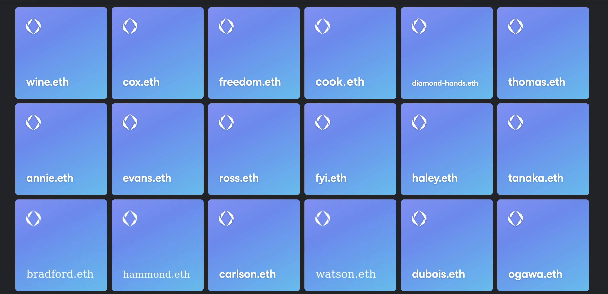
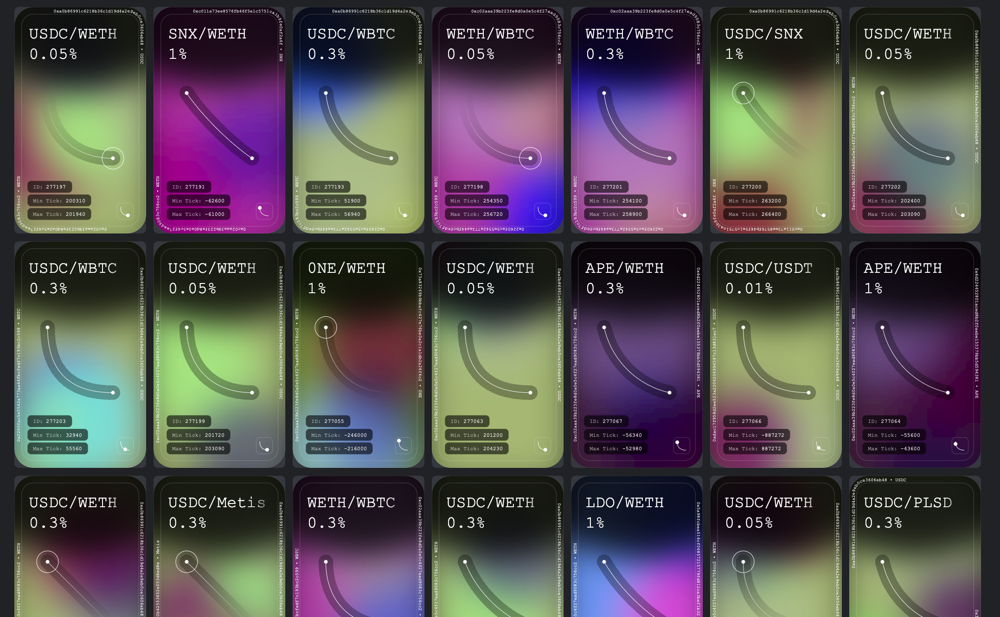

# Use Cases

> The use cases listed below are some of the more common, popular, or well known applications for NFTs that exist currently. This list is not exhaustive, as new/niche use cases are regularly emerging. Each of these use cases could utilize any combination of the **types** discussed earlier.

## Fine Art
Fine art encompasses a wide range of mediums and disciplines such as painting, drawing, photography, sculpture, and more. When it comes to fine art, NFTs act sort of like a digital certificate of authenticity that the artist signs cryptographically and which accompanies the relevant media file(s). That being said, there are many examples of NFTs themselves being either a part of or the entire work of art itself (with no accompanying visual that is being pointed to). Fine art NFTs have become a relatively solidified part of even mainstream culture at this point, having been adopted by traditional institutions such as Sotheby’s, Christie’s, and more. One of the most promising aspects of fine art NFTs are their ability to automatically track and permanently preserve the provenance of an artwork.

- [SuperRare](https://superrare.com/)
- [CryptoPunk’s for sale at Christie’s](https://www.christies.com/lot/lot--6316969/)
- [Jen Stark on Foundation](https://whitewall.art/art/jen-stark-sets-records-with-first-nft)

)](../../images/encyclopedia/fine-art.png)
*One of the 10,000 pieces from Damien Hirst’s first art project utilizing NFTs. ([Source](https://opensea.io/assets/ethereum/0xaadc2d4261199ce24a4b0a57370c4fcf43bb60aa/9831))*

## Music 
Music NFTs are an emerging domain of tokens that aim to provide musicians with a more viable method of revenue creation by tapping into an artist’s most passionate fans. In some ways, it’s a more effective evolution of mp3 purchases that introduces real scarcity and ownership tracking. Unlike in the old days of iTunes and CD burning, a musician could release their songs on all the major streaming platforms for anyone to listen to, while also releasing an exclusive set of 50 NFTs of the music that are aimed at collectors and super fans. The NFTs could even grant access to exclusive insider access, merch, or discounts.

- [sound.xyz](https://sound.xyz)
- [catalog.works](https://catalog.works/)
- [Songcamp’s “Chaos Festival”](https://www.fwb.help/wip/chaos-reigns-songcamp-music-web3)

 to release limited edition NFTs of her music that her fans can collect and trade. ([Source](https://www.sound.xyz/pussyriot/laugh-it-off))](../../images/encyclopedia/musicnfts.png)
*Well-known musical artist Pussy Riot has used a platform called [sound.xyz](http://sound.xyz) to release limited edition NFTs of her music that her fans can collect and trade. ([Source](https://www.sound.xyz/pussyriot/laugh-it-off))*

## PFP (Profile Pictures)
Profile pictures (often called PFPs) are a type of artwork NFT that are designed specifically to be used as a person’s display avatar on a social media site like Twitter or Facebook. A few well-known examples of these types of NFTs would be Bored Ape Yacht Club, CryptoPunks, World of Women, and Doodles. Instead of using a headshot or a selfie of oneself, many members of the emerging “Web3” ecosystem choose to represent themselves by using an illustrated character for their avatar instead. Some people do this because they prefer to remain pseudonymous online. The trend of repping PFP NFTs became so popular in 2021 that some social networking sites like Twitter added native support for them as a full-fledged feature. A PFP NFT project typically has a community and avid fan base surrounding it in addition to also sometimes having dedicated storytelling, games, merch, live events, etc. While it may seem strange to outsiders, the PFP NFT phenomenon is somewhat similar to movie fandoms, sports teams, or band fan bases. The cultural dynamics found within these groups are nothing particular new, they are merely ongoing examples of common social bonding.

- [CryptoPunks](https://www.larvalabs.com/cryptopunks)
- [Doodles](https://doodles.app/)
- [World of Women](https://worldofwomen.art/)

)](../../images/encyclopedia/coolcats.png)
*Cool Cats is a popular 10,000 supply PFP project with an avid fanbase, live events, and even a game. ([Source](https://www.coolcatsnft.com/))*

## Memes
Internet culture has a rich history of meme generation and propagation, but it hasn’t been easy for the creator or spreaders of a meme to materially benefit from a meme’s success. Memes are often shared unattributed and right-clicked-saved, but with the advent of NFTs, memes can finally be owned, tracked, collected, bought, and sold in a verifiable way. In 2021, there were numerous examples of early-internet memes being minted as NFTs by their creators and then being sold for high dollar amounts at auction for profit or charity.

)](../../images/encyclopedia/memes.png)
*The owner and photographer of the Doge meme auctioned off 1/1 NFTs for charity in 2021. ([Source](https://very.auction/))*

## Writing
While many people think of visual media when they think of NFTs, there are plenty of non-visual applications for them such as the written word. Essayists, story-tellers, poets, and more can mint their works as NFTs and put them up for auction or sale so that collectors and patrons may support their craft financially. Web3 blogging platforms like Mirror have emerged that make NFTs a native publishing experience, allowing readers of a publication to “collect” each new post as an NFT edition. These editions can then be bought, sold, used or traded by fans and collectors. NFTs of written works often come in the form of a visual representation of the work (a cover image), raw text stored directly on-chain, and/or a text file held on a decentralized storage solution like IPFS.

- [mirror.xyz](https://mirror.xyz)
- [$NOVEL crowdfund](https://emily.mirror.xyz/0AFENlMKv9amUC1OJIZY26udpISw_raXkoEcvelPvzg)
- [theVERSEverse](https://theverseverse.com/)

)](../../images/encyclopedia/writing.png)
*Web3 writer Chase Chapman uses Mirror to publish her work. Readers can collect some of her posts as NFTs and support her work. ([Source](https://chase.mirror.xyz/PjnfkklAMUcEIBQuZ-An5xlBheQchsLwkRx6GHPfGzw?wnft=true))*

## Social Media
On a fundamental level, an NFT is simply a unique and verifiable representation of something else. This makes them extremely powerful for experimental concepts. Emerging Web3 social media platforms like Lens Protocols are actually using NFTs to represent all of the different actions and components of a social experience so that the platform can be built upon by anyone and accessed in a permissionless fashion. In the case of Lens Protocol, every “follow” is an NFT. If “Person A” follows “Person B”, an NFT is generated and sent to Person A’s wallet that represents the relationship.

- [Farcaster](https://www.farcaster.xyz/)
- [Lens](https://lens.xyz)
- [Interface](https://www.interface.social/)

)](../../images/encyclopedia/lens.png)
*Lens Protocol is an emerging social ecosystem based on decentralized on-chain data. ([Source](https://lens.xyz))*

## Domains
Domain names have been around for a long time and are a pre-web3 example of a piece of digital property. NFT and blockchain technology can be applied to domains to make them more own-able and less centralized. Whereas with traditional domains you have to always interact and go through an intermediary, domains as NFTs and blockchain records allow for greater user control and autonomy. 

- [ENS Domains](https://ens.domains/)
- [Unstoppable Domains](https://unstoppabledomains.com/)

*Example of ENS Domain NFTs.*

## Events
Perhaps one of the most promising and practical applications for NFTs is in the realm of events and live shows such as concerts, movies, and sports. On the simplest level, a ticket to an event can be an NFT that lives in a person’s wallet. Once the event is over, they’re able to keep the digital ticket as a collectible item. NFT event tickets can be managed by smart contracts on the blockchain that automatically enforce certain agreements and even resale limitations. Event goods such as merchandise and posters can even be offered in the form of NFTs to coincide with the digital experience around ticketing.

- [Gatekeeper](https://gatekeep.it/)
- [Unlock Protocol](https://unlock-protocol.com/)

)](../../images/encyclopedia/unlock.png)
*An example of ticketing an event using Unlock Protocol. ([Source](https://unlock-protocol.com/blog/ethcc5-2022-ticketing))*

## Memberships
An NFT can also be used to represent membership in a group, club, or entity. While NFTs are permanent digital objects, their utility or benefits do not have to last permanently. An expiration date or criteria could be hardcoded into the smart contract that governs the NFT. 

)](../../images/encyclopedia/membership.png)
*Poolsuite is a luxury lifestyle brand that utilizes NFTs to grant access to its events, products, and perks. ([Source](https://members.poolsuite.net/))*

## Gaming
Perhaps one of the most promising and multi-faceted use cases for non-fungible tokens, gaming NFTs have the potential to change the ways in which people interact with video games at almost every touch point. Not only can individual in-game assets be ownable NFTs, but the games themselves can be too. A character could be an NFT that possesses certain ability NFTs that then interact with item NFTs. An even more experimental and innovative use-case for NFTs in gaming can be seen with [Loot Project](https://www.lootproject.com/). In the universe of Loot, there is a base layer of underlying game items without any game attached so that people can build numerous games and projects around the same thing.

- [Dark Forest](https://zkga.me/)
- [Parallel](https://parallel.life/)

)](../../images/encyclopedia/gaming.png)
*A blockchain-based game called Dark Forest utilizes NFTs in a variety of ways such as in-game items and prizes. ([Source](https://gitcoin.co/grants/2323/dark-forest))*

## Financial Assets
In the world of decentralized finance, NFTs can be used to represent many different financial assets like a person’s stake in a fund or asset, their liquidity position on an exchange like Uniswap, or even things like loans. 

*Examples of Uniswap’s NFTs that represent Liquidity Positions on their decentralized exchange.*

[Continue to **Components** section](/encyclopedia/part-1/components)
