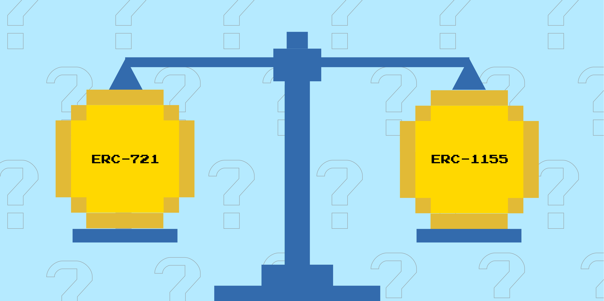

# Choosing a Standard

*Things to consider when choosing between the ERC-721 standard or the ERC-1155 standard.*

## Editions

Let’s say you are a fine artist who wants to release editions of your work. You could use either token standard, but the ERC-1155 standard is much more suitable to a collection of items that have quantities, both for efficiency and display reasons. An exception to this would be if you really want each NFT to have a unique edition number.

*An example of a multi-edition NFT that utilizes the ERC-721 standard. In cases like this, each NFT has a unique number and is separated from one another. One downside to this is that it can be difficult to navigate or sort through when you own a lot of the same edition.*

*An example of a multi-edition NFT that utilizes the ERC-1155 standard. In cases like this, each NFT is stackable and has a quantity listed in the top left instead of individual unique numbers. There are 30 NFTs in the screenshot above, but because they use the ERC-1155 standard they are both stackable and more efficient to use.*

## Compatibility

While the ERC-1155 standard offers some significant features beyond ERC-721, the downside is it’s not as widely supported yet by various platforms. The ERC-721 standard is older and has had longer to establish itself as the go-to standard for NFTs, whereas the 1155 standard is still working to get a foothold in some places despite its superior feature set. 

Why is this important to note? Well, if there is a specific tool, platform, or community that you or your NFT owners will need to use, it’s important to make sure that it supports whichever NFT standard you’re thinking of using. For example, marketplaces like Zora and Foundation currently only support the ERC-721 standard. Furthermore, some token-gating tools that allow creators to limit access to content based on NFT ownership only support the ERC-721 standard as well.

## Use Cases

In general, almost all of the use cases we covered in Part 1 could theoretically be done with both token standards. That being said, there are a few use cases that are best suited to a particular standard. Profile Picture (PFP) NFTs almost always utilize the ERC-721 standard due to cultural dynamics and platform compatibility. Gaming NFTs usually benefit from the enhanced and more flexible feature set of the ERC-1155 standard. If you’re exploring a use case that is already well explored, it could be helpful to take a look at popular examples from that genre to see if there’s a consensus or expectation.

## Perception/Desirability

As has been mentioned several times already, the better feature set provided by the ERC-1155 standard doesn’t always make it the clear choice, at least not yet. Not only is this due to compatibility issues, but it also can be because audiences, collectors, or potential buyers might have ingrained preferences that could impact your project’s success. Just because a standard looks better on paper doesn’t mean it will be accepted by every target market or community. Consider looking at other projects within your niche for examples of what you’re thinking about doing to ensure the decision won’t create hurdles for you.

## Feature Comparison

| ERC-721           | ERC-1155                                  |
|-------------------|-------------------------------------------|
| Not stackable     | Stackable                                 |
| Non-fungible only | Fungible, Semi-fungible, and Non-fungible |
| Widely supported  | Not supported everywhere yet              |
| Single transfers  | Batch transfers                           |

[Continue to next section](/encyclopedia/part-2/choosing-types)
