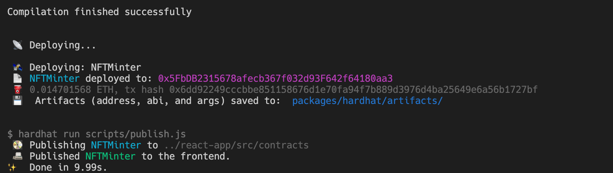
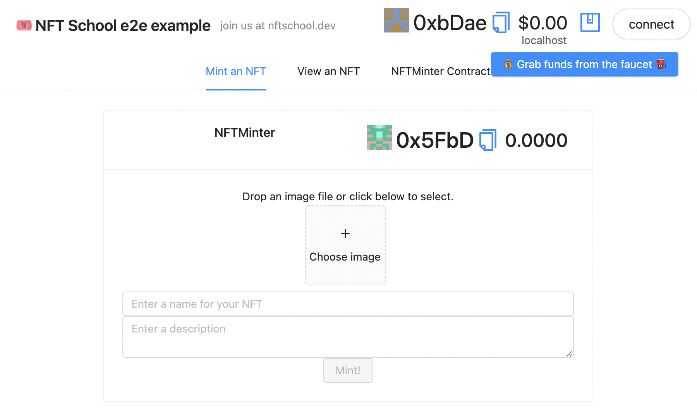
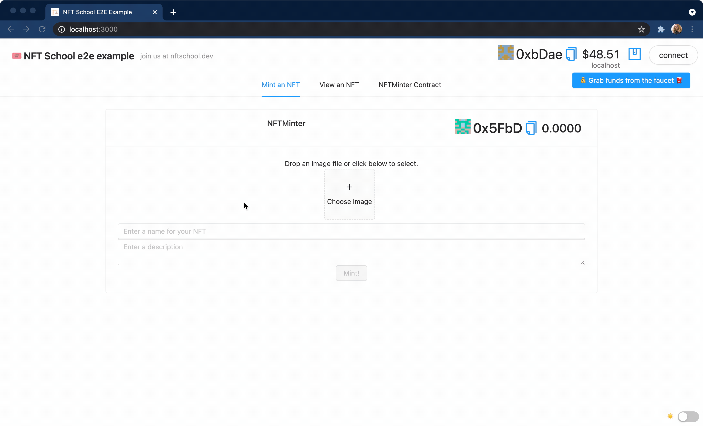

# End-to-end experience

In this tutorial, you will go from zero to creating a freshly minted NFT token and storing it on IPFS and Filecoin using [nft.storage](https://nft.storage), all in a decentralized web app built using JavaScript, the [ethers.js](https://docs.ethers.io/) library, and React.

We'll be minting NFTs on the Ethereum blockchain for this guide. However, the concepts described here can just as easily be applied to other blockchains. If you're curious, see [Blockchains and NFTs](/concepts/blockchains.md) for an overview of some of the blockchain networks that can be used for NFT projects and how they differ from Ethereum.

If you've never worked with Ethereum or another smart contract platform before, our [first steps guide](/tutorial/first-steps.md) will walk you through a quick "hello world" example using an Ethereum testnet.

## Why IPFS and nft.storage?

Our example uses a free service called [nft.storage](https://nft.storage) to add an image file and our NFT's metadata to [IPFS](https://ipfs.io), the InterPlanetary File System. We go deeper into why IPFS is a good fit for NFTs in our discussion of [content addressing][docs-cid], but for now, we'll just give an overview.

When an NFT is created and linked to a digital file that lives on some other system, _how_ the data is linked is critical. There are a few reasons why traditional HTTP links aren't a great fit for the demands of NFTs.

With an HTTP address like `https://cloud-bucket.provider.com/my-nft.jpg`, anyone can fetch the contents of `my-nft.jpg`, as long as the owner of the server pays their bills. However, there's no way to guarantee that the _contents_ of `my-nft.jpg` are the same as they were when the NFT was created. The server owner can easily replace `my-nft.jpg` with something different at any time, causing the NFT to change its meaning.

This problem was demonstrated by an artist who [pulled the rug](https://cointelegraph.com/news/opensea-collector-pulls-the-rug-on-nfts-to-highlight-arbitrary-value) on NFTs he created by changing their images after they were minted and sold to others.

IPFS solves this potentially catastrophic problem thanks to its use of [_content addressing_][docs-cid]. Adding data to IPFS produces a [_content identifier_][ipfs-docs-cid] (CID) that is directly derived from the data itself, and links to the data in the IPFS network. Because a CID can only _ever_ refer to one piece of content, we know that nobody can replace or alter the content without breaking the link.

Using that CID, anyone can fetch a copy of its data from the IPFS network as long as at least one copy exists on the network — even if the original provider has disappeared. This makes CIDs perfect for NFT storage. All we need to do is put the CID into an `ipfs://` URI such as `ipfs://bafybeidlkqhddsjrdue7y3dy27pu5d7ydyemcls4z24szlyik3we7vqvam/nft-image.png`, and we have an immutable link from the blockchain to our token's data.

Of course, there may be some cases in which you _do_ want to change the metadata for an NFT after it's been published. That's no problem! You'll just need to add support to your smart contract for updating the URI for a token after it's been issued. That will let you change the original URI to a new IPFS URI while still leaving a record of the initial version in the blockchain's transaction history. This provides accountability by making it clear to everyone what was changed, when, and by whom.

Using nft.storage, we can make our NFT data available on IPFS for free, with [content persistence](/concepts/content-persistence) automatically taken care of! Notably, nft.storage includes both long-term "cold storage" in the decentralized [Filecoin](https://filecoin.io) network, as well as "hot storage" using [IPFS Cluster](https://cluster.ipfs.io/). As a nice bonus, you also get a JavaScript [client library][nft-storage-js-client] that helps you upload data to IPFS and generate NFT metadata all in one line of code.

## Getting set up

To help explain how NFTs and IPFS work together, we've created an example decentralized web app, or _dAapp_, based on the excellent starter framework [`scaffold-eth`](https://github.com/austintgriffith/scaffold-eth).

The `scaffold-eth` framework is a "batteries included" boilerplate with all kinds of helpful components and integrations, some of which we won't cover at all in this guide. However, once you've followed this tutorial, you can dig deeper into `scaffold-eth`'s functionality by exploring the rest of the example code or by checking out the projects showcased at the [Buidl Guidl](https://buidlguidl.com), a group of Ethereum devs focused on educating and growing the Ethereum developer community.

### Prerequisites

You'll need [git](https://git-scm.com/), [node.js](https://nodejs.org), and [yarn](https://yarnpkg.com/) installed to follow along with this tutorial. 

The example app uses [React](https://reactjs.org) for the user interface, taking advantage of the components built into `scaffold-eth`. If you're already a React developer, you should feel right at home. If you're new to React or prefer a different framework, that's no problem. We'll be keeping this guide focused on managing NFT assets and smart contract interactions, and those will apply to any UI framework or design pattern.

### Get the code

Let's check out the example repository so we can start playing with NFTs!

1.  Clone [the nft-school-examples repository][nft-school-examples-repo] and move into the `nft-school-examples/end-to-end` directory:

    ```shell
    git clone https://github.com/ipfs-shipyard/nft-school-examples
    cd nft-school-examples/end-to-end
    ```

1.  Install the JavaScript dependencies with `yarn`:

    ```shell
    yarn install
    ```

1.  Start a local blockchain simulator (also called a [_devnet_](/tutorial/first-steps.md#devnet)):

    ```shell
    yarn chain
    ```

    This will output some information about the accounts on the local devnet. Keep this terminal open, and open a new terminal for the next few commands.

1. In a new terminal, deploy the `NFTMinter` smart contract:

    ```shell
    yarn deploy
    ```

    You should see something like this:

    

1. Start the development server for the React web app:

    ```shell
    yarn start
    ```

    This command will keep running, so keep the terminal open while you play with the app. 
    
    Once the server has started, it will print the URL of the front end. By default, the URL is `http://localhost:3000`, but you may see a different URL if you've already got something listening on port 3000.

1. If your browser doesn't open automatically, navigate to the URL shown in the last command's output.

    You should see a page that looks something like this:

    

1. Get some fake Ether (ETH) to play with.

    To mint an NFT, we need to pay a small amount of ETH in [_gas_](https://ethereum.org/en/developers/docs/gas/), which is a fee charged by miners for operations that change the blockchain's state.

    Thanks to `scaffold-eth`, getting some fake ETH to play with on our local devnet is simple. Out of the box, `scaffold-eth` creates a new "burner account" with an empty balance, so you don't need to connect to a wallet such as [MetaMask][metamask] just to load the app.

    Click the button that says **Grab funds from the faucet** to get some play money. You should see a popup showing the ID of the transaction, quickly followed by an update in the account balance at the top of the screen. Now you're ready to mint!

    ::: tip
    The faucet button will only show up when using a local devnet. If you deploy the contract to a testnet or mainnet, your users will need to use the **Connect** button to sign in with a wallet like [MetaMask][metamask].
    :::

1. Get an API key for nft.storage

    To make requests to nft.storage, you need an API key.

    [Login or sign up for a free account](https://nft.storage/login), then [create an API key](https://nft.storage/manage/).

    Copy the key to your clipboard, and edit the file `end-to-end/packages/react-app/src/constants.js`.

    Near the top of the file, replace the value of the `NFT_STORAGE_KEY` constant with the token you copied earlier.

## Mint an NFT

To mint an NFT in our example, all you need to do is select a file (we'll use an image), give it a name and optional description, and hit the **Mint** button! This will upload your image and metadata to [nft.storage](https://nft.storage), which will give us an IPFS URI we can store on the blockchain. Then we call a function on the smart contract to mint the token. Once the transaction is confirmed, we're done!

Below is an animated-GIF example of the whole process:



## How minting works

So far we've minted an NFT, added it to an Ethereum blockchain, and hosted it on IPFS. Now we're going to dive into _exactly_ what the contract does and why. We're also going to explore the IPFS side of things and how the NFT itself is stored.

### The NFTMinter smart contract

Our example uses a smart contract written in [Solidity](https://soliditylang.org), the most popular language for Ethereum development. The contract implements the [ERC-721 Ethereum NFT standard][eip-721] by virtue of inheriting from the convenient and fully featured [OpenZeppelin ERC721 base contract](https://docs.openzeppelin.com/contracts/3.x/api/token/erc721#ERC721).

Because the OpenZeppelin base contract provides so much of the core functionality, the `NFTMinter` contract is simple:

```solidity
//SPDX-License-Identifier: MIT
pragma solidity ^0.7.0;

import "hardhat/console.sol";
import "@openzeppelin/contracts/token/ERC721/ERC721.sol";
import "@openzeppelin/contracts/utils/Counters.sol";

contract NFTMinter is ERC721 {
    using Counters for Counters.Counter;
    Counters.Counter private _tokenIds;

    constructor(string memory tokenName, string memory symbol) ERC721(tokenName, symbol) {
        _setBaseURI("ipfs://");
    }

    function mintToken(address owner, string memory metadataURI)
    public
    returns (uint256)
    {
        _tokenIds.increment();

        uint256 id = _tokenIds.current();
        _safeMint(owner, id);
        _setTokenURI(id, metadataURI);

        return id;
    }
}
```

If you read the [OpenZeppelin ERC721 guide](https://docs.openzeppelin.com/contracts/3.x/erc721), you'll see that our contract is extremely similar. The `mintToken` function simply increments a counter to issue token IDs, and it uses the `_setTokenURI` function provided by the base contract to associate the metadata URI with the new token ID.

One thing to notice is that we set the base URI prefix to `ipfs://` in the constructor. When we set a metadata URI for each token in the `mintToken` function, we don't need to store the prefix, since the base contract's `tokenURI` accessor function will apply it to each token's URI.

::: warning
It's important to note that **this contract is not production-ready**. It doesn't include any [access controls][docs-openzeppelin-access-control] to limit which accounts are allowed to call the `mintToken` function. If you decide to develop a production platform based on this example, you should explore the access control patterns that are available, and consider which should apply to your platform's access model.
:::

### Ethereum-flavored JavaScript

The `scaffold-eth` project we used to create the example app has a lot of code, but we can ignore most of it for this tutorial. We'll just focus on the things related to NFTs, and leave you to explore the rest of the boilerplate components included with `scaffold-eth`.

All the code below can be found in the [`end-to-end/packages/react-app/src/components/Minter.jsx` file](https://github.com/ipfs-shipyard/nft-school-examples/blob/main/end-to-end/packages/react-app/src/components/Minter.jsx) in the [NFT School examples](https://github.com/ipfs-shipyard/nft-school-examples) repo. 

We won't get into the details of the UI code, but feel free to tinker with it if you want to make things look nicer!

For this guide, we'll just look at the heart of the minting process. First, we get our image and metadata onto IPFS using [nft.storage](https://nft.storage). Then we use the URI for our metadata to call the smart contract's `mintToken` function.

#### Uploading to IPFS with nft.storage

Getting our data into IPFS is simple, thanks to the nft.storage [client library][nft-storage-js-client]. All we need to do is create a new client and call the [`store` method](https://ipfs-shipyard.github.io/nft.storage/client/classes/lib.nftstorage.html#store):

```javascript
  const client = new NFTStorage({ token: NFT_STORAGE_KEY });
  const metadata = await client.store({
    name,
    description,
    image,
  });
```

The `metadata` object returned by the `store` method has a `url` property with the IPFS URI for our metadata. Next we'll look at how to get that URI into the blockchain.

#### Calling the `mintToken` smart-contract function

Let's look at how our code interacts with the smart contract's `mintToken` function.

```javascript
  // our smart contract already prefixes URIs with "ipfs://", so we remove it before calling the `mintToken` function
  const metadataURI = metadata.url.replace(/^ipfs:\/\//, "");

  // scaffold-eth's Transactor helper gives us a nice UI popup when a transaction is sent
  const transactor = Transactor(provider, gasPrice);
  const tx = await transactor(contract.mintToken(ownerAddress, metadataURI));

  setStatus("Blockchain transaction sent, waiting confirmation...");

  // Wait for the transaction to be confirmed, then get the token ID out of the emitted Transfer event.
  const receipt = await tx.wait();
  let tokenId = null;
  for (const event of receipt.events) {
    if (event.event !== 'Transfer') {
        continue
    }
    tokenId = event.args.tokenId.toString();
    break;
  }
```

The real action happens in the `contract.mintToken` call. The `contract` here is an object provided by the [ethers.js library](https://docs.ethers.io/v5/) that's connected to our smart contract. 

We wrap the call with a `Transactor`, which is a helper provided by `scaffold-eth` to create a nice UI popup with the transaction details.

We want to get the ID of the new token, but because the `mintToken` function modifies the blockchain's state, it can't return a value right away. This is because the function call creates a new Ethereum transaction, and there's no way to know for sure that the block containing the transaction will actually be mined and incorporated into the blockchain — for example, there may not be enough gas to pay for the transaction.

To get the token ID for our new NFT, we need to call `tx.wait()`, which waits until the transaction has been confirmed. The token ID is wrapped inside a `Transfer` event, which is emitted by the base contract when a new token is created or transferred to a new owner. By inspecting the transaction receipt returned from `tx.wait()`, we can pull the token ID out of the `Transfer` event.

That's it! Once the transaction has been confirmed, our NFT is on the blockchain, with the image and metadata served from IPFS and stored with Filecoin.

You can view an NFT after it's been minted by switching to the "NFT Viewer" tab and entering a token ID into the box.

## Next steps

That was quite a lot to cover! We've seen how to add assets to IPFS and create NFT metadata, and how to link our metadata to a new NFT on Ethereum.

So far, we've been playing in a local development "sandbox," so our NFTs are pretty ephemeral. As a next step, try deploying the contract to a testnet, and update the front end to connect to it! The [`scaffold-eth` deploy docs](https://github.com/austintgriffith/scaffold-eth#-deploy) can get you started. The Ethereum docs have a page about the different [networks](https://ethereum.org/en/developers/docs/networks/) that can help you choose the right testnet, and you can get some test ETH to play with from one of the public [testnet faucets](https://ethereum.org/en/developers/docs/networks/#testnet-faucets). Have fun!


[nft-school-examples-repo]: https://github.com/ipfs-shipyard/nft-school-examples

[minty-code-get-nft]: https://github.com/yusefnapora/minty/blob/39a3e79e01b4776372a08fa352c8fe508ffa9845/src/minty.js#L193-L212
[js-ipfs-remote-pin-pr]: https://github.com/ipfs/js-ipfs/pull/3588
[eip-721]: https://eips.ethereum.org/EIPS/eip-721
[pin-service-api]: https://ipfs.github.io/pinning-services-api-spec/
[docs-openzeppelin-access-control]: https://docs.openzeppelin.com/contracts/3.x/access-control
[docs-openzeppelin-upgrade]: https://docs.openzeppelin.com/contracts/3.x/upgradeable
[express-js]: https://expressjs.com
[koa-js]: https://koajs.com
[metamask]: https://metamask.io
[nft-bible]: https://opensea.io/blog/guides/non-fungible-tokens
[docs-cid]: ../concepts/content-addressing/
[docs-server-infra]: https://docs.ipfs.io/install/server-infrastructure/
[ipfs-docs-cid]: https://docs.ipfs.io/concepts/content-addressing/
[nft-storage-js-client]: https://www.npmjs.com/package/nft.storage