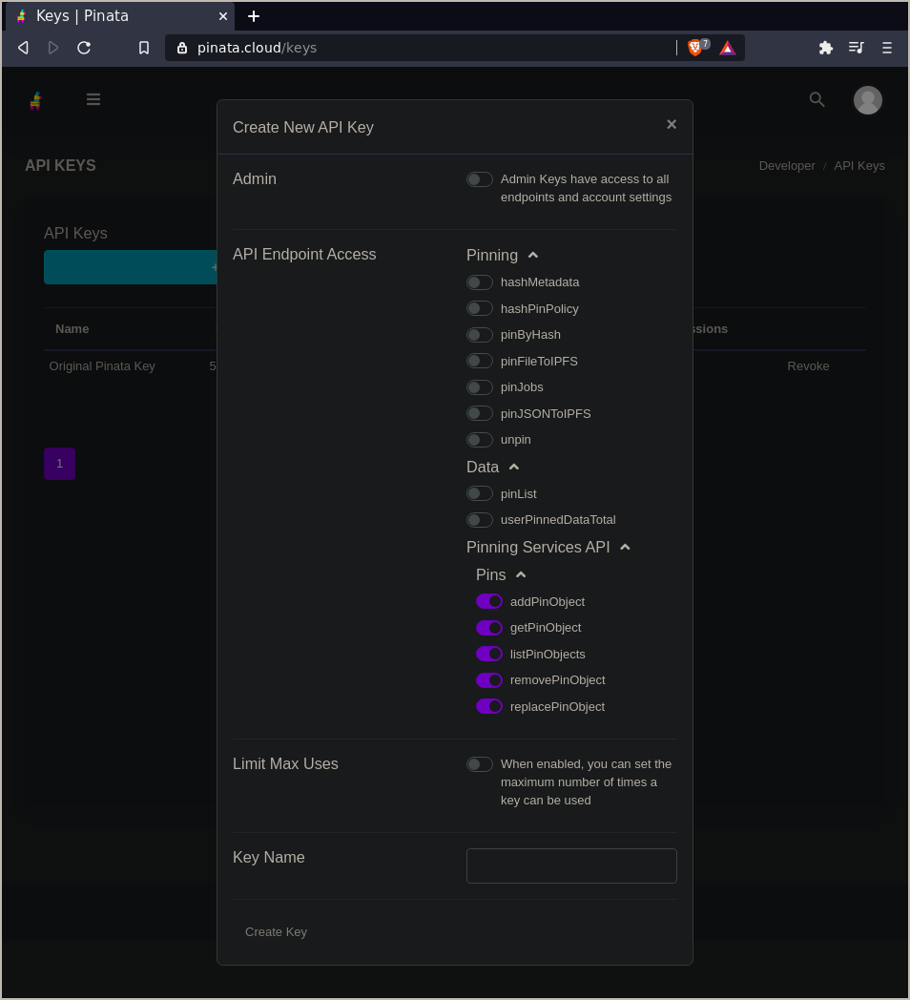

# End-to-end experience

In this tutorial, you will go from zero to creating a freshly minted NFT token and storing it on IPFS using services like [nft.storage](https://nft.storage) and [Pinata](https://pinata.cloud).

Since IPFS isn't a blockchain, we'll be leveraging the power of the Ethereum blockchain for this guide. However, the steps described here can just as easily be applied to other blockchains.

## How IPFS helps

When an NFT is created and linked to a digital file that lives on some other system, _how_ the data is linked is extremely  important. There are a few reasons why traditional HTTP links aren't a great fit for the demands of NFTs.


With an HTTP address like `https://cloud-bucket.provider.com/my-nft.jpg`, anyone can fetch the contents of `my-nft.jpg`, as long as the owner of the server pays their bills. However, there's no way to guarantee that the _contents_ of `my-nft.jpg` are the same as they were when the NFT was created. The server owner can easily replace `my-nft.jpg` with something different at any time, causing the NFT to change its meaning.

This problem was demonstrated by an artist who [pulled the rug](https://cointelegraph.com/news/opensea-collector-pulls-the-rug-on-nfts-to-highlight-arbitrary-value) on NFTs he created by changing their images after they were minted and sold to others.

IPFS solves this potentially catastrophic problem thanks to its use of [_content addressing_][docs-cid]. Adding data to IPFS produces a _content identifier_ (CID) that is directly derived from the data itself, and links to the data in the IPFS network. Because a CID can only _ever_ refer to one piece of content, we know that nobody can replace or alter the content without breaking the link.

Using that CID, anyone can fetch a copy of its data from the IPFS network as long as at least one copy exists on the network — even if the original provider has disappeared. This makes CIDs perfect for NFT storage. All we need to do is put the CID into an `ipfs://` URI such as `ipfs://bafybeidlkqhddsjrdue7y3dy27pu5d7ydyemcls4z24szlyik3we7vqvam/nft-image.png`, and we have an immutable link from the blockchain to our token's data.

Of course, there may be some cases in which you _do_ want to change the metadata for an NFT after it's been published. That's no problem! You'll just need to add support to your smart contract for updating the URI for a token after it's been issued. That will let you change the original URI to a new IPFS URI while still leaving a record of the initial version in the blockchain's transaction history. This provides accountability by making it clear to everyone what was changed, when, and by whom.

## Minty

To help explain how NFTs and IPFS work together, we've created **Minty** — a simple command-line application to automatically _mint_ an NFT and pin it to IPFS using [nft.storage](https://nft.storage) or [Pinata](https://pinata.cloud).

Production NFT platforms are a fairly complex thing. As with any modern web application, there are lots of decisions to make surrounding the tech stack, user interface conventions, API design, and so on. Blockchain-enabled dApps also need to interact with user wallets such as [Metamask](https://metamask.io), further increasing their complexity.

Since Minty was written to demonstrate the concepts and process of minting IPFS-backed NFTs, we don't need to get caught up in all the details of modern dApp development. Instead, Minty is a simple command-line app written in JavaScript.

### Install Minty

Let's get Minty installed so we can start playing with NFTs! To install and run Minty, you must have NPM installed. Windows is not currently supported. Installing Minty is fairly simple: Just download the GitHub repository, install the NPM dependencies, and start the local [testnet](/tutorial/first-steps/#testnet) environment.

1.  Clone [the Minty repository][minty-repo] and move into the `minty` directory:

    ```shell
    git clone https://github.com/yusefnapora/minty
    cd minty
    ```

1.  Install the NPM dependencies:

    ```shell
    npm install
    ```

1.  Add the `minty` command to your `$PATH`. This step is optional, but it makes it easier to run Minty from anywhere on your computer:

    ```shell
    npm link
    ```

1.  Run the `start-local-environment.sh` script to start the local Ethereum testnet and IPFS daemon:

    ```shell
    ./start-local-environment.sh

    > Compiling smart contract
    > Compiling 16 files with 0.7.3
    > ...
    ```

    Because this command continues to run, all further commands must be entered in another terminal window.

### Deploy the contract

Before running any of the other `minty` commands, you'll need to deploy an instance of the
smart contract:

```shell
minty deploy

> deploying contract for token Julep (JLP) to network "localhost"...
> deployed contract for token Julep (JLP) to 0x5FbDB2315678afecb367f032d93F642f64180aa3 (network: localhost)
> Writing deployment info to minty-deployment.json
```

This deploys to the network configured in `hardhat.config.js`, which is set to the `localhost` network by default. If you get an error about not being able to reach the network, make sure you started the local development network with `./start-local-environment.sh`.

When this contract is deployed, the address and other information about the deployment are written to `minty-deployment.json`. This file must be present for subsequent commands to work.

### Mint an NFT

Once you have the local Ethereum network and IPFS daemon running, minting an NFT is incredibly simple. Just specify the file that you want to _tokenize_, give the NFT a name, and add a description to tell users what the NFT is for.

#### Create something to mint

First, let's create something to mint. NFTs have a huge range of use cases, and you can mint whatever you want! For this example, we're going to create a ticket for a flight to the moon.

1. Create a file called `flight-to-the-moon.txt`:

    ```shell
    touch ~/flight-to-the-moon.txt
    ```

1. Open the file and enter some flight information:

    ```
    THE INTERPLANETARY TRAVEL COMPANY
    ---------------------------------
    Departing: Cape Canaveral, Earth
    Arriving: Base 314, The Moon
    Boarding time: 17:30 UTC
    Seat number: 1A
    Baggage allowance: 5kg
    ```

1. Save and close the file.

#### Mint the file

Now we're going to tokenize our ticket into an NFT. This process is often called _minting_.

1.  Call the `mint` command and supply the location of the file we want to mint, the name of our NFT, and a description:

    ```shell
    minty mint ~/ticket.txt --name "Moon Flight #1" --description "This ticket serves as proof-of-ownership of a first-class seat on a flight to the moon."
    ```

    The `minty mint` command returns the ID of the new token, some metadata containing the `name` and `description` we provided, and an IPFS URI for the file we used for our NFT asset. The `Metadata URI` in the output above is the IPFS URI for the NFT Metadata JSON object that's stored on IPFS.

Great work so far — you've created your NFT! **However, it's only available to other people as long as you have your IPFS node running.** If you shut down your computer or you lose your internet connection, then no one else will be able to view your NFT. To get around this issue, you should _pin_ it to a _pinning service_.

### Pin your NFT

To make your NFT's data highly available without needing to run your own IPFS node 24/7, you can request that a remote [pinning service](https://docs.ipfs.io/how-to/work-with-pinning-services/) store a copy of your data on their IPFS nodes.

Any pinning service that supports the [IPFS Remote Pinning API](https://ipfs.github.io/pinning-services-api-spec) can be used with Minty.

Below, we'll explain how to configure Minty with two different pinning services. Either one will work, so you'll only need to sign up for one service to try things out.

#### Option 1: nft.storage

[nft.storage](https://nft.storage) is a new service offered by [Protocol Labs](https://protocol.ai) to store public NFT data. It's currently a free public beta, so it's easy to sign up and try.

##### Sign up for nft.storage

To use nft.storage for your NFT data, you'll need to sign up for an account. You'll also need a GitHub account for logging in, if you don't already have one.

1. Head over to [nft.storage](https://nft.storage).
1. Click **Register** and use your GitHub account to register.

##### Get an API key

You need to copy an API key from the nft.storage site and put it where Minty can find it.

1. Log into nft.storage and select **Manage API Keys** from the top menu.
1. Click **New Key**.
1. The new key should show up in the list. Copy the key to your clipboard. It should be a long string starting with `ey...`.

Next, we need to put the key into a file where Minty can find it.

1.  Copy the `config/nft.storage.env.example` file to `config/.env`:

    ```shell
    cp config/nft.storage.env.example config/.env
    ```

1.  Inside `config/.env`, add your API key to the `PINNING_SERVICE_KEY` line _between_ the double quotes `"`:

    ```shell
    PINNING_SERVICE_KEY="eyJhbGciOiJIUzI1NiIsInR5cCI6IkpXVCJ9.eyJ1c2VySW5mb3JtYXRpb24iOnsia..."
    ```

1. Minty can now connect to nft.storage and pin NFT data to your account!

#### Option 2: Pinata

[Pinata](https://pinata.cloud) is one of the oldest and most popular IPFS pinning services, and their free storage tier makes it easy to sign up and experiment.

##### Sign up for Pinata

To use Pinata to pin your data, you need to sign up for an account.

1. Head over to [pinata.cloud](https://pinata.cloud/).
1. Click **Sign up** and use your email address to create an account.

Pinata gives each user 1 GB of free storage space, which is plenty for storing a few NFTs.

##### Get an API key

Next, you need to grab an API key from Pinata. Your API key allows Minty to interact automatically with your Pinata account.

1. Log into Pinata and select **API keys** from the sidebar menu.
1. Click **New Key**.
1. Expand the **Pinning Services API** drop-down and select all the options under **Pins**:

    

1. Pinata will give you an _API key_, and _API secret_, and a _JWT_:

    ```
    API Key: 43537d17e88805007086
    API Secret: 492b24f041b9120cbf8e35a247fb686793231a3d89045f1046a4f5b2d2175082
    JWT: eyJhbGciOiJIUzI1NiIsInR5cCI6IkpXVCJ9.eyJ1c2VySW5mb3JtYXRpb24iOnsiaWQiOiJiZDQ3NjM1Ny1lYWRhLTQ1ZDUtYTVmNS1mM2EwZjRmZGZmYmEiLCJlbWFpbCI6InRhaWxzbm93QHByb3Rvbm1haWwuY29tIiwiZW1haWxfdmVyaWZpZWQiOnRydWUsInBpbl9wb2xpY3kiOnsicmVnaW9ucyI6W3siaWQiOiJGUkExIiwiZGVzaXJlZFJlcGxpY2F0aW9uQ291bnQiOjF9XSwidmVyc2lvbiI6MX0sIm1mYV9lbmFibGVkIjpmYWxzZX0sImF1dGhlbnRpY2F0aW9uVHlwZSI6InNjb3BlZEtleSIsInNjb3BlZEtleUtleSI6IjQzNTM3ZDE3ZTg4ODA1MDA3MDg2Iiwic2NvcGVkS2V5U2VjcmV0IjoiNDkyYjI0ZjA0MWI5MTIwY2JmOGUzNWEyNDdmYjY4Njc5MzIzMWEzZDg5MDQ1ZjEwNDZhNGY1YjJkMjE3NTA4MiIsImlhdCI6MTYxNjAxMzExNX0.xDV9-cPwDIQInuiB0M--XiJ8dQwwDYMch4gJbc6ogXs
    ```

    We just need the `JWT`. You can ignore the `API Key` and `API Secret` for now.

1. Copy the `config/pinata.env.example` file to `config/.env`:

    ```shell
    cp config/pinata.env.example config/.env
    ```

1. Inside `config/.env`, add your JWT token to the `PINNING_SERVICE_KEY` line _between_ the double quotes `"`:

    ```shell
    PINNING_SERVICE_KEY="eyJhbGciOiJIUzI1NiIsInR5cCI6IkpXVCJ9.eyJ1c2VySW5mb3JtYXRpb24iOnsia..."
    ```

1. Minty can now connect to Pinata and pin NFT data to your account!

### Deploying to a testnet

Take a look at the [Hardhat configuration docs](https://hardhat.org/config/) to learn how to configure a JSON-RPC node and deploy this contract to a testnet. Once you've added a new network to the Hardhat configuration, you can use it by setting the `HARDHAT_NETWORK` environment variable to the name of the new network when you run `minty` commands. Alternatively, you can change the `defaultNetwork` in `hardhat.config.js` to always prefer the new network.

::: tip Important note
Deploying this contract to the Ethereum mainnet is a bad idea, since the contract itself lacks any access control. To learn more about what access control is and why it's important to have, see this [OpenZeppelin article](https://docs.openzeppelin.com/contracts/3.x/access-control).
:::

## How Minty works

So far we've minted an NFT, added it to an Ethereum blockchain, and hosted it on IPFS. Now we're going to dive into _exactly_ what the contract does and why. We're also going to explore the IPFS side of things and how the NFT itself is stored.

### The Minty smart contract

Minty uses a smart contract written in [Solidity](https://soliditylang.org), the most popular language for Ethereum development. The contract implements the [ERC-721 Ethereum NFT standard][eip-721] by virtue of inheriting from the very convenient and fully featured [OpenZeppelin ERC721 base contract](https://docs.openzeppelin.com/contracts/3.x/api/token/erc721#ERC721).

Because the OpenZeppelin base contract provides so much of the core functionality, the Minty contract is simple:

```solidity
pragma solidity ^0.7.0;

import "hardhat/console.sol";
import "@openzeppelin/contracts/token/ERC721/ERC721.sol";
import "@openzeppelin/contracts/utils/Counters.sol";

contract Minty is ERC721 {
    using Counters for Counters.Counter;
    Counters.Counter private _tokenIds;

    constructor(string memory tokenName, string memory symbol) ERC721(tokenName, symbol) {
        _setBaseURI("ipfs://");
    }

    function mintToken(address owner, string memory metadataURI)
    public
    returns (uint256)
    {
        _tokenIds.increment();

        uint256 id = _tokenIds.current();
        _safeMint(owner, id);
        _setTokenURI(id, metadataURI);

        return id;
    }
}
```

If you read the [OpenZeppelin ERC721 guide](https://docs.openzeppelin.com/contracts/3.x/erc721), you'll see that the Minty contract is extremely similar. The `mintToken` function simply increments a counter to issue token IDs, and it uses the `_setTokenURI` function provided by the base contract to associate the metadata URI with the new token ID.

One thing to notice is that we set the base URI prefix to `ipfs://` in the constructor. When we set a metadata URI for each token in the `mintToken` function, we don't need to store the prefix, since the base contract's `tokenURI` accessor function will apply it to each token's URI.

It's important to note that **this contract is not production-ready**. It doesn't include any [access controls][docs-openzeppelin-access-control] to limit which accounts are allowed to call the `mintToken` function. If you decide to develop a production platform based on Minty, please explore the access control patterns that are available, and consider which should apply to your platform's access model.

#### Deploying the contract

Before you can mint new NFTs, you need to deploy the contract to a blockchain network. Minty uses [Hardhat](https://hardhat.org) to manage contract deployment. By default, Minty deploys to an instance of the [Hardhat development network](https://hardhat.org/hardhat-network) that's been [configured to run on your machine's localhost network](https://hardhat.org/hardhat-network/#connecting-to-hardhat-network-from-wallets-and-other-software).

It's also possible to deploy the contract to an [Ethereum test network](https://ethereum.org/en/developers/docs/networks/) by editing the `hardhat.config.js` file in the Minty repo. See the [Hardhat documentation](https://hardhat.org/config/#json-rpc-based-networks) to learn how to configure Hardhat to deploy to a node connected to a testnet, either running locally or hosted by a provider such as [Infura](https://infura.io). Because deployment consumes Ether (ETH) as gas, you'll need to obtain some test ETH for your chosen network and configure Hardhat to use the correct wallet.

#### Calling the `mintToken` smart-contract function

Let's look at how Minty's JavaScript code interacts with the smart contract's `mintToken` function. This happens in the `mintToken` method of the `Minty` class:

```javascript
async mintToken(ownerAddress, metadataURI) {
  // The smart contract adds an ipfs:// prefix to all URIs,
  // so make sure to remove it so it doesn't get added twice
  metadataURI = stripIpfsUriPrefix(metadataURI)

  // Call the mintToken smart contract function to issue a new token
  // to the given address. This returns a transaction object, but the
  // transaction hasn't been confirmed yet, so it doesn't have our token id.
  const tx = await this.contract.mintToken(ownerAddress, metadataURI)

  // The OpenZeppelin base ERC721 contract emits a Transfer event
  // when a token is issued. tx.wait() will wait until a block containing
  // our transaction has been mined and confirmed. The transaction receipt
  // contains events emitted while processing the transaction.
  const receipt = await tx.wait()
  for (const event of receipt.events) {
    if (event.event !== 'Transfer') {
        console.log('ignoring unknown event type ', event.event)
        continue
    }
    return event.args.tokenId.toString()
  }

  throw new Error('unable to get token id')
}
```

As you can see, calling the smart contract function is mostly like calling a normal JavaScript function, thanks to the [ethers.js smart contract library](https://docs.ethers.io/v5/). However, since the `mintToken` function modifies the blockchain's state, it can't return a value right away. This is because the function call creates an Ethereum transaction, and there's no way to know for sure that the block containing the transaction will actually be mined and incorporated into the blockchain — for example, there may not be enough gas to pay for the transaction.

To get the token ID for our new NFT, we need to call `tx.wait()`, which waits until the transaction has been confirmed. The token ID is wrapped inside a `Transfer` event, which is emitted by the base contract when a new token is created or transferred to a new owner. By inspecting the transaction receipt returned from `tx.wait()`, we can pull the token ID out of the `Transfer` event.

### Storing NFT data on IPFS

The smart contract's `mintToken` function expects an IPFS metadata URI, which should resolve to a JSON object describing the NFT. Minty uses the metadata schema described in [EIP-721][eip-721], which supports JSON objects like this:

```json
{
    "name": "A name for this NFT",
    "description": "An in-depth description of the NFT",
    "image": "ipfs://bafybeidlkqhddsjrdue7y3dy27pu5d7ydyemcls4z24szlyik3we7vqvam/nft-image.png"
}
```

The `image` field contains a URI that resolves to the NFT image data we want to associate with the token. This field doesn't necessarily have to be an image; it can be any file type.

To get the metadata URI for our smart contract, we first add the image data to IPFS in order to get an IPFS [CID][docs-cid], and use the CID to build an `ipfs://` URI. Then we create a JSON object containing the image URI along with the user-provided `name` and `description` fields. Finally, we add the JSON data to IPFS to create the metadata `ipfs://` URI and feed that into the smart contract.

Minty's `createNFTFromAssetData` method is responsible for this process, with help from a few utility functions:

```javascript
async createNFTFromAssetData(content, options) {
  // add the asset to IPFS
  const filePath = options.path || 'asset.bin'
  const basename =  path.basename(filePath)

  // When you add an object to IPFS with a directory prefix in its path,
  // IPFS will create a directory structure for you. This is nice, because
  // it gives us URIs with descriptive file names in them e.g.
  // 'ipfs://bafybeihhii26gwp4w7b7w7d57nuuqeexau4pnnhrmckikaukjuei2dl3fq/cat-pic.png' vs
  // 'ipfs://bafybeihhii26gwp4w7b7w7d57nuuqeexau4pnnhrmckikaukjuei2dl3fq'
  const ipfsPath = '/nft/' + basename
  const { cid: assetCid } = await this.ipfs.add({ path: ipfsPath, content })

  // make the NFT metadata JSON
  const assetURI = ensureIpfsUriPrefix(assetCid) + '/' + basename
  const metadata = await this.makeNFTMetadata(assetURI, options)

  // add the metadata to IPFS
  const { cid: metadataCid } = await this.ipfs.add({
    path: '/nft/metadata.json',
    content: JSON.stringify(metadata)
  })
  const metadataURI = ensureIpfsUriPrefix(metadataCid) + '/metadata.json'

  // get the address of the token owner from options,
  // or use the default signing address if no owner is given
  let ownerAddress = options.owner
  if (!ownerAddress) {
    ownerAddress = await this.defaultOwnerAddress()
  }

  // mint a new token referencing the metadata URI
  const tokenId = await this.mintToken(ownerAddress, metadataURI)

  // format and return the results
  return {
    tokenId,
    metadata,
    assetURI,
    metadataURI,
    assetGatewayURL: makeGatewayURL(assetURI),
    metadataGatewayURL: makeGatewayURL(metadataURI),
  }
}
```

We're adding our data to IPFS using a `path` argument with a directory structure, e.g., `/nft/metadata.json` instead of just `metadata.json`. This isn't strictly necessary, but it gives us more descriptive URIs that include human-readable file names. On the downside, the metadata URI requires a bit more space on-chain since it includes the `/metadata.json` portion in addition to the IPFS CID. In a production environment where bytes cost money, you may want to modify the smart contract to only store the CID portion and automatically append the file name before returning the URI, or simply store metadata without a directory wrapper.

### Retrieving NFT data

To view the metadata for an existing NFT, we call the smart contract's `tokenURI` function, then fetch the JSON data from IPFS and parse it into an object. This happens in `getNFTMetadata`:

```javascript
async getNFTMetadata(tokenId) {
  const metadataURI = await this.contract.tokenURI(tokenId)
  const metadata = await this.getIPFSJSON(metadataURI)

  return {metadata, metadataURI}
}
```

See the [`getNFT` method][minty-code-get-nft] for an example that also fetches the asset data from IPFS by resolving the URI in the metadata's `image` field.

The `getNFT` method is used by the `minty` command-line app to view a token using the `minty show <token-id>` command:

```
minty show 14

Token ID:              14
Owner Address:         0xf39Fd6e51aad88F6F4ce6aB8827279cffFb92266
Metadata URI:          ipfs://bafybeieeomufuwkwf7sbhyo7yiifaiknm7cht5tc3vakn25vbvazyasp3u/metadata.json
Metadata Gateway URL:  http://localhost:8080/ipfs/bafybeieeomufuwkwf7sbhyo7yiifaiknm7cht5tc3vakn25vbvazyasp3u/metadata.json
Asset URI:             ipfs://bafybeifszd4wbkeekwzwitvgijrw6zkzijxutm4kdumkxnc6677drtslni/ipfs-logo-768px.png
Asset Gateway URL:     http://localhost:8080/ipfs/bafybeifszd4wbkeekwzwitvgijrw6zkzijxutm4kdumkxnc6677drtslni/ipfs-logo-768px.png
NFT Metadata:
{
  "name": "The IPFS Logo",
  "description": "The IPFS logo (768px, png)",
  "image": "ipfs://bafybeifszd4wbkeekwzwitvgijrw6zkzijxutm4kdumkxnc6677drtslni/ipfs-logo-768px.png"
}
```

If you have an IPFS-enabled browser like [Brave](https://brave.com) installed, you can paste the `Asset URI` or `Metadata URI` into the address bar directly and see the content served up by your local IPFS node. If your browser doesn't support IPFS natively, you can use the `Asset Gateway URL` or `Metadata Gateway URL` instead, which will serve the data from a local HTTP gateway.

You can also try using a public gateway like the one at [https://ipfs.io](https://ipfs.io). To do so, replace `http://localhost:8080` in the gateway URL with `https://ipfs.io`. However, you may notice that this takes a little longer than requesting the same file from your local node. This is because the public gateway doesn't have a copy of the data yet, so it has to look up the CID on the IPFS network and fetch it from your local IPFS node.

### Pinning NFT data to a remote service

When you add data to IPFS, it first gets added to your local IPFS node, which advertises the CID of the data to the IPFS network. This lets anyone request the data by looking up the CID and connecting to your node directly. Once they've done so, their IPFS node will hold on to a copy temporarily, which helps speed up access to the data if another node requests it. However, by default these extra copies will eventually expire and be "garbage collected" so that people running IPFS nodes don't use up all of their storage space.

When minting NFTs, we generally want our data to be at least as _durable_ as the blockchain platform the token was minted on, and we want it to be available all the time and across the globe.

As an NFT minting platform, you can certainly run your own IPFS infrastructure to ensure the storage of your users' NFT assets. See the official IPFS [server infrastructure documentation][docs-server-infra] for more details, including how using [IPFS Cluster](https://cluster.ipfs.io) can provide highly available IPFS storage and retrieval that scales to a large volume of data and requests.

As an alternative to running your own infrastructure, you can arrange for an IPFS pinning service to pin your data to their IPFS nodes, which are already tuned for high volume and reliability.

Minty uses the [IPFS Pinning Service API][pin-service-api] to request that a remote pinning service store that data for a given token, using the `minty pin <token-id>` command.

The default Minty configuration expects to find an environment variable name `PINATA_API_TOKEN` containing the JWT access token for a Pinata account. Once you have a token, you can create a file called `config/default.env` in the Minty repo and make it look similar to this:

```shell
PINATA_API_TOKEN="Paste JWT token here"
```

Now when you run `minty pin`, Minty should have everything it needs to connect to Pinata.

If you decide to use a different pinning service, change the configuration entry for Pinata in the `config/default.js` file in the Minty repo.

Here's an example of running `minty pin <token-id>`:

```
minty pin 2
Pinning asset data (ipfs://bafybeifszd4wbkeekwzwitvgijrw6zkzijxutm4kdumkxnc6677drtslni/ipfs-logo-768px.png) for token id 2....
Pinning metadata (ipfs://bafybeieeomufuwkwf7sbhyo7yiifaiknm7cht5tc3vakn25vbvazyasp3u/metadata.json) for token id 2...
🌿 Pinned all data for token id 2
```

This first looks up the token metadata and then sends a request to the pinning service to pin the asset CID and the metadata CID.

In the code, this happens in the `pinTokenData` method:

```javascript
async pinTokenData(tokenId) {
  const {metadata, metadataURI} = await this.getNFTMetadata(tokenId)
  const {image: assetURI} = metadata

  console.log(`Pinning asset data (${assetURI}) for token id ${tokenId}....`)
  await this.pin(assetURI)

  console.log(`Pinning metadata (${metadataURI}) for token id ${tokenId}...`)
  await this.pin(metadataURI)

  return {assetURI, metadataURI}
}
```

The actual pin request is sent in the `pin` method:

```javascript
async pin(cidOrURI) {
  const cid = extractCID(cidOrURI)

  // Make sure IPFS is set up to use our preferred pinning service.
  await this._configurePinningService()

  // Check if we've already pinned this CID to avoid a "duplicate pin" error.
  const pinned = await this.isPinned(cid)
  if (pinned) {
      return
  }

  // Ask the remote service to pin the content.
  // Behind the scenes, this will cause the pinning service to connect to our local IPFS node
  // and fetch the data using Bitswap, IPFS's transfer protocol.
  await this.ipfs.pin.remote.add(cid, { service: config.pinningService.name })
}
```

Because the IPFS Pinning Service API expects a CID and we may have a full `ipfs://` URI, we use a helper called `extractCID` to pull out the CID portion.

Then, we call `_configurePinningService` to tell IPFS to use the remote service if it hasn't already been configured.

We do a check to see if we've already pinned this CID, since the API will return an error if we try to pin content that's already been pinned. Alternatively, you could just try to pin a CID and check to see if the returned error is for duplicate content.

Finally, we call `ipfs.pin.remote.add`, passing in the name of the pinning service. When the pinning service receives the request, it will try to connect to our local IPFS node, and our local node will also try to connect to the pinning service's IPFS nodes. Once they're connected, the service will fetch the CIDs we asked it to pin and store the data on the pinning service's infrastructure.

To verify that the data was pinned, you can run `ipfs pin remote ls --service=pinata` to see a list of the content you've pinned to Pinata. If you don't already have a copy of IPFS installed on your machine, you can use the one bundled with Minty by running `npx go-ipfs pin remote ls --service=pinata` instead. Alternatively, you can log into the [Pinata website](https://pinata.cloud) and use the **Pin explorer** to view your data.

## Next steps

That was quite a lot to cover! We've seen how to add assets to IPFS and create NFT metadata, how to link our metadata to a new NFT on Ethereum, and how to pin our data with a remote provider for persistence.

At this point, you might be wondering how to take these techniques and use them to build a production NFT minting platform. Of course, there are many decisions involved in any new product or marketplace, so we can't think of everything here. **But there are a few places where Minty is clearly not production-ready**, and by looking at them, we can get a good idea of what technical work might be involved in building your own platform.

As a command-line app, `minty` is a pretty big departure from the rich, interactive web applications that power NFT minting platforms. If you want to build a web platform based on the techniques shown in Minty, you will either need to expose Minty's functionality via an HTTP API or go the _fully decentralized_ route and interact with the NFT contract directly in the user's Ethereum-enabled web browser. The good news is that all the concepts we've learned so far are applicable to either environment.

Since Minty currently runs on Node.js, it's straightforward to add an API server using one of the many Node HTTP frameworks like [Express][express-js] or [Koa][koa-js]. However, it can be difficult to allow users to sign Ethereum transactions with their own private keys if the code is running on a back-end server. As such, you may want to put some blockchain logic in the front end so that users can use [MetaMask][metamask] or a similar wallet to authorize token transfers.

Work is also underway to [support the IPFS Pinning Service API][js-ipfs-remote-pin-pr] in `js-ipfs`, so soon you'll be able to run the entire process in the user's browser using an embedded IPFS node.

If you're building a dApp without a back-end server today and just can't wait, you could also use an HTTP API provided by a pinning service to send and pin content using traditional HTTP requests, instead of embedding `js-ipfs` into your dApp. See [Pinata's documentation][pinata-docs] for an example. This makes your dApp code a little less generic, since it's tied to one provider's API, but it may be a good way to get started. Doing everything in the browser also means you'll need to carefully manage the API tokens for the pinning services you support, perhaps by allowing users to add their own credentials and storing the tokens in the browser's local storage.

Finally, please remember that the Minty smart contract is intentionally simple and is not tailored to the needs of a production platform. In particular, it lacks [access controls][docs-openzeppelin-access-control] and is not [upgradable][docs-openzeppelin-upgrade] without re-deploying the contract. Chances are you'll want your contract to include features that are unique to your platform as well, beyond the base ERC-721 functionality.

Thanks for following along! We can't wait to see what you'll build.

<!-- TODO: move minty repo to ipfs-shipyard? -->

[minty-repo]: https://github.com/yusefnapora/minty
[minty-code-get-nft]: https://github.com/yusefnapora/minty/blob/39a3e79e01b4776372a08fa352c8fe508ffa9845/src/minty.js#L193-L212
[js-ipfs-remote-pin-pr]: https://github.com/ipfs/js-ipfs/pull/3588
[eip-721]: https://eips.ethereum.org/EIPS/eip-721
[pin-service-api]: https://ipfs.github.io/pinning-services-api-spec/
[pinata]: https://pinata.cloud
[pinata-docs]: https://pinata.cloud/documentation
[pinata-blog]: https://medium.com/pinata
[docs-openzeppelin-access-control]: https://docs.openzeppelin.com/contracts/3.x/access-control
[docs-openzeppelin-upgrade]: https://docs.openzeppelin.com/contracts/3.x/upgradeable
[express-js]: https://expressjs.com
[koa-js]: https://koajs.com
[metamask]: https://metamask.io
[nft-bible]: https://opensea.io/blog/guides/non-fungible-tokens
[docs-cid]: ../concepts/content-addressing/
[docs-server-infra]: https://docs.ipfs.io/install/server-infrastructure/
