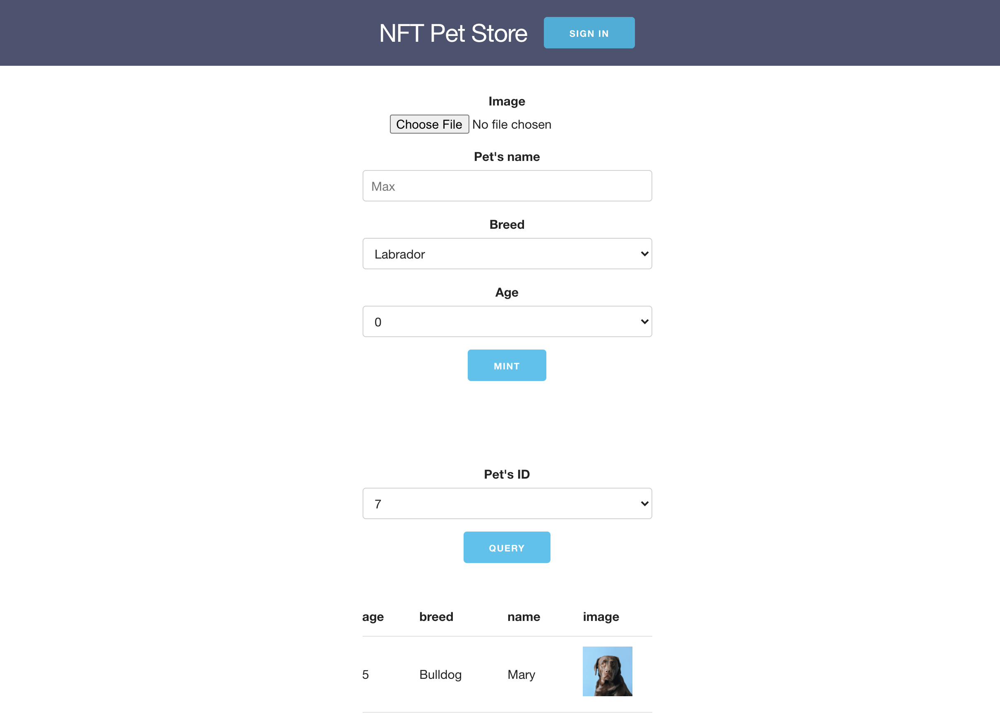
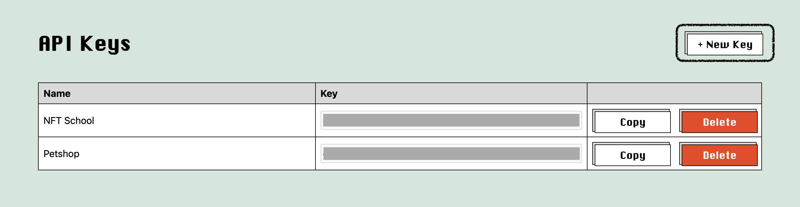
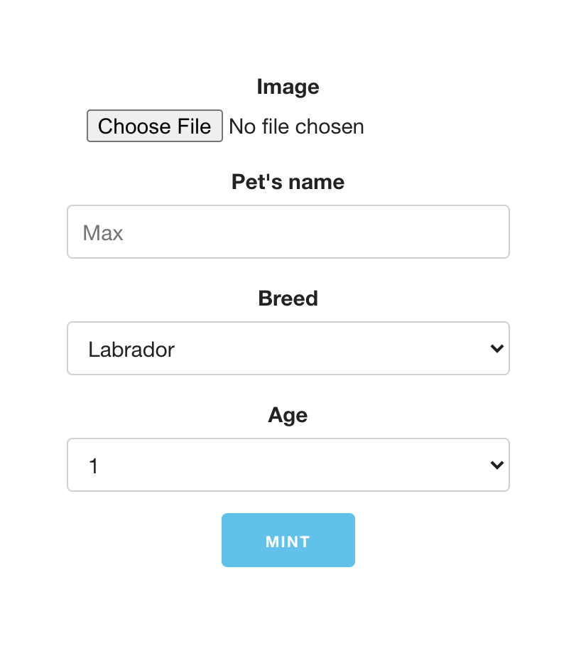
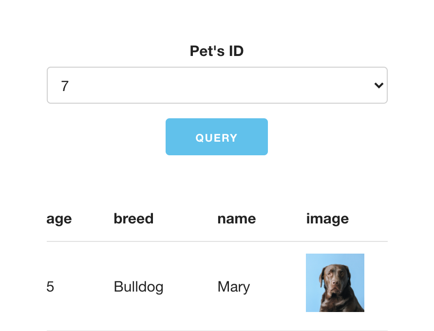

# Building a Flow NFT pet store

This tutorial will teach you to create a simple NFT marketplace on the [Flow][flow] blockchain from scratch, using the Flow blockchain and IPFS/Filecoin storage via [nft.storage][nft-storage]. Although we will be building a pet store using pet images, you are free to use your own images and change the metadata.

## Prerequisites

Although this tutorial is built for Flow, it focuses on building up a basic understanding of smart contract and NFTs. You are expected to bring a working JavaScript and basic [React.js][React] skills to the table, but a passing familiarity with blockchains, web3, and NFTs will be just fine if you are happy to catch up.

You will need to install [Node.js][nodejs] and npm (comes with Node.js), [Flow command line tool][flow-cli], and [Docker compose][docker-compose] to follow this tutorial. You're free to use any code editor, but [VSCode][vscode] with [Cadence Language support][vscode-cdc-ext] is a great option.

> **💡 Using React**
> React.js is the most widely-used UI library that arguably takes away the tediousness of setting up a JavaScript app. You are welcome to work with another library/framework if you are happy to take on the additional work of taking the [road less travelled][robert-frost-poem] approach.

If you are very new to the concept of smart contracts and NFTs, it is worth checking out [blockchain][blockchain-basic] and [NFT][nft-basic] basics before diving in.

## What you will learn

As we build a minimal version of the [Flowwow NFT pet store][flowwow] together, you will learn the basic NFT building blocks from the ground up, including:

- Smart contracts and the [Cadence language][cadence]
- User authentication
- Minting tokens and storing metadata on Filecoin/IPFS via [NFT.storage][nft-storage]
- Transferring tokens

## Understanding ownership and resource

A blockchain is a digital distributed ledger that tracks an *ownership* of some *resource*. There is nothing new about the ledger part—Your bank account is a ledger that keeps track of how much money you *own* and how much is spent (change of ownership) at any time. The key components to a ledger are:

- [Resource](resource) at play. In this case a currency.
- [Accounts](accounts) to own the resource, or the access to it.
- [Contract](contract) or a ruleset to govern the economy.

### Resource

A resource can be any *thing* — from currency, crop, to digital monster — as long as the type of resource is agreed upon commonly by all accounts.

### Accounts

Each account owns a ledger of its own to keep track of the spending (transferring) and imbursing (receiving) of the resource.

### Contract

A contract is a ruleset governing how the "game" is played. Accounts that break the ruleset may be punished in some way. Normally, it is a central authority like a bank who creates this contract for all accounts.

Because the conventional ledgers are owned and managed by a trusted authority like your bank, when you transfer the ownership of a few dollars (`-$4.00`) to buy a cup of coffee from Mr. Peet, the bank needs to be consistent and update the ledgers on both sides to reflect the ownership change (Peet has `+$4.00` and you have `-$4.00`). Because both ledgers are not openly visible to both of Peet and you and the the currency is likely digital, there is no guarantee that the bank won't mistakenly or intentionally update either ledger with the incorrect value.

> **💡 Do you know your bank owes you?**
> If you have a saving account with some money in it, you might be loaning your money to your bank. You are trusting your bank to have your money when you want to withdraw. Meanwhile, your money is just part of the stream of your bank is free to do anything with. If you had a billion dollars in your bank and you want to withdraw tomorrow, your teller might freak out.

What is interesting about a blockchain is the distributed part. Because there is only a single *decentralized* ledger that's open to everyone, there is no central authority like a bank for you to trust with bookkeeping. In fact, there is no need for you to trust anyone at all. You only need to trust the copy of the common ledger software run by other people in the network to uphold the bookkeeping, and it is very hard for someone to run an altered version of that software and attempt to break the rule.

A good analogy is an umpire-less tennis game where any dispute (like determining if the ball lands in the court) is distributed to all the audience to judge. Meanwhile, these audience members are also participating in the game, with the stake that makes them lose if they judge wrongly. This way, any small inconsistencies are likely caught and rejected fair and square. You are no longer trusting your bank. The eternal flow of ownerships hence becomes *trustless* because everyone is doing what's best for themselves.

"Why such emphasis on ownership?" you may ask. This is because Flow has the concept of resource ownership baked right into the smart contract core. Learning to visualize resource will help in understanding concepts in Flow, as you shall see very soon.

## Quick tour of Cadence

Like Solidity language for Ethereum, Flow uses [Cadence][cadence] language to code smart contracts, transactions, and scripts on Flow. Cadence's design is inspired by the [Rust][rust] and [Move][move] languages. In Cadence, the runtime tracks when a resource is being *moved* from a variable to the next and makes sure it can never be mutually accessible in the program.

The three types of Cadence program you will be writing are [contracts][contract], [transactions][transaction], and [scripts][script].

### Contract

A contract is an initial program that gets deployed to the blockchain, initiating the logic for your app and allowing access to resources you create and the capabilities that come with them.

Two of the most common constructs in a contract are **resources** and **interfaces**.

#### Resources

Resources are items stored in user accounts that are accessible
through access control measures defined in the contract. They are usually the assets being tracked or some capabilities, such as a capability to withdraw an asset from an account. They are akin to classes or structs in some languages. Resources can only be in one place at a time, and they are said to be *moved* rather than *assigned*.

#### Interfaces

Interfaces define the behaviors or capabilities of resources. They are akin to interfaces in some languages. They are usually implemented by other resources. Interfaces are also defined with the keyword `resource`.

Here is an example of an `NFT` resource and an `Ownable` interface (à la [ERC721][erc-721]) in a separate `PetShop` contract:

```rust
pub contract PetShop {

    // A map recording owners of NFTs
    pub var owners: {UInt64 : Address}

    // A Transferrable interface declaring some methods or "capabilities"
    pub resource interface Transferrable {
      pub fun owner(): Address
      pub fun transferTo(recipient: Address)
    }

    // NFT resource implements Transferrable
    pub resource NFT: Transferrable {

        // Unique id for each NFT.
        pub let id: UInt64

        // Constructor method
        init(initId: UInt64) {
            self.id = initId
        }

        pub fun owner(): Address {
          return owners[self.id]!
        }

        pub fun transferTo(recipient: Address) {
          // Code to transfer this NFT resource to the recipient's address.
        }
    }
}
```

Note the access modifier `pub` before each definition. This declares public access for all user accounts. Writing a Cadence contract revolves around designing access control.

### Transaction

Transactions tell the on-chain contract to change the state of the chain. Like Ethereum, the change is synchronized throughout the peers and cannot be undone. Therefore, a transaction is considered a *write* operation that incurs a network gas fee. Transactions require one or more accounts to sign and authorize. For instance, minting and transferring tokens are transactions.

Here is an example of a transaction which requires a current account to sign a certain action that mutate the chain's state. In this case, just logging "Hello, transaction".

```rust
transaction(tokenId: UInt64, recipientAddr: Address) {

    // The field holds the NFT as it is being transferred.
    let token: @PetStore.NFT

    // Takes the sending account as a parameter to
    prepare(acc: AuthAccount) {
        // This is the code that requires a signature, such as
        // withdrawing a token from the signing account.
    }

    execute {
        // This is the code that does not require a signature.
        log("Hello, transaction")
    }
}
```

### Script

Scripts are Cadence programs that are run on the client to *read* the state of the chain. Therefore, they do not incur any gas fee and do not need an account to sign them.

Here is an example of a script reading an NFT's current owner's account address by accessing the map field named `owners` on the contract by an `NFT` id:

```rust
// Take a target NFT's id as a parameter and return an Address
// of the current owner of that NFT.
pub fun main(id: UInt64) : Address {
    return PetStore.owner[id]!
}
```

Both transactions and scripts are invoked on the client side.

> **💡 Interface in other languages**
> If you have programmed in a typed language like Java, Rust, or TypeScript, you might be familiar with the interface, which is a description of capabilities versus a concrete entity like a class or struct. In Cadence, a resource is similar to a class or struct and an interface is the same as those in Java or Rust.

## Building pet store

Now that we had a quick tour of Cadence, we are ready to start building the mini NFT pet store! We will be learning as we build.

Create a new React app by typing the following commands in your shell:

```bash
npx create-react-app petstore; cd petstore
```

And initialize a Flow project:

```bash
flow init
```

You should see a new React project created with a `flow.json` configuration file inside. Let's take a closer look at the structure and configure the project.

### Project structure

First of all, note the `flow.json` file under the root directory. This configuration file was created when we typed the command `flow init` and tells Flow that this is a Flow project. We will leave most of the initial settings as they were, but make sure it contains these fields by adding or changing them accordingly:

```json
{
    // ...

    "contracts": {
        "PetStore": "./src/flow/contracts/PetStore.cdc"
    },

    "deployments": {
    "emulator": {
      "emulator-account": ["PetStore"]
    }
  },

    // ...
}
```

These fields tell Flow where to look for the contract so we will be able to run the command line to deploy it to the Flow emulator. Now we will need to add some directories for our Cadence code.

Because `create-react-app` forbids importing code from outside of the `src` directory, the majority of the code we write will be under `src`.

Create a directory named `flow` inside `src` directory, and create three more subdirectories named `contract`, `transaction`, and `script` under `flow`. This can be combined into one command:

```bash
mkdir -p src/flow/{contract,transaction,script}
```

As you might have guessed, each directory will contain the corresponding Cadence code for each type of interaction.

Now, in each of these directories, create a Cadence file with the following names: `contract/PetStore.cdc`, `transaction/MintToken.cdc`, and `script/GetTokenIds.cdc`.

The structure of the `src` directory should now look like this:

```bash
.
|— flow
|   |— contract
|   |   |
|   |   `— PetStore.cdc
|   |— script
|   |   |
|   |   `— GetTokenIds.cdc
|   `— transaction
|       |
|       `— MintToken.cdc
|
...
```

### `PetStore` contract

> **💡 Don't reinvent the wheel**
> As you move toward building on testnet and finally mainnet, you will want to take a look at [existing interfaces](https://docs.onflow.org/dapp-development/smart-contracts/#nft-sales-and-trading-nft-sales-and-trading) and implement them. However, building our own interfaces is a great way to learn, and learning is our goal here.

Now, we will write our first contract.

First, create the contract structure and define an `NFT` resource:

```rust
pub contract PetStore {

    // An array that stores NFT owners
    pub var owners: {UInt64: Address}

    pub resource NFT {

        // Unique ID for each NFT
        pub let id: UInt64

        // String mapping to hold metadata
        pub var metadata: {String: String}

        // Constructor method
        init(id: UInt64, metadata: {String: String}) {
            self.id = id
            self.metadata = metadata
        }
    }
}
```

Note that we have declared a [Dictionary][cdc-dict-type] and stored it in a variable named `owners`. This dictionary has the type `{UInt64: Address}` which maps [unsigned 64-bit integers][cdc-integer-type] to users' [Addresses][cdc-address-type]. We will use `owners` to keep track of all the current owners of NFTs globally.

Also note that the `owners` variable is prepended by a `var` keyword, while the `id` variable is prepended by a `let` keyword. In Cadence, a mutable variable is defined using `var` while an immutable one is defined with `let`.

> **💡 Immutable vs mutable**
> In Cadence, a variable stores a mutable variable that can be changed later in the program while a *binding* binds an immutable value that cannot be changed.

In the body of `NFT` resource, we declare `id` field and a constructor method to assign the `id` to the `NFT` instance.

### `NFTReceiver`

Next, we create an `NFTReceiver` interface that defines the capabilities or methods of a receiver of NFTs, or the rest of the users who are not the contract user.

To reiterate, an interface is *not* an instance of an object, like a user account. It is a set of behaviors, or capabilities in Cadence's speak, that a resource can implement to become capable of certain actions, like withdrawing and depositing tokens.

```rust
pub contract PetStore {

    // ... The @NFT code ...

    pub resource interface NFTReceiver {

        // Withdraw a token by its ID and returns the token.
        pub fun withdraw(id: UInt64): @NFT

        // Deposit an NFT to this NFTReceiver instance.
        pub fun deposit(token: @NFT)

        // Get all NFT IDs belonging to this NFTReceiver instance.
        pub fun getTokenIds(): [UInt64]

        // Get the metadata of an NFT instance by its ID.
        pub fun getTokenMetadata(id: UInt64) : {String: String}

        // Update the metadata of an NFT.
        pub fun updateTokenMetadata(id: UInt64, metadata: {String: String})
    }
}
```

Let's not get over ourselves and go through the `NFTReceiver` interface line-by-line.

The `withdraw(id: UInt64): @NFT` method takes an NFT's `id`, withdraws a token, or an *instance* of `NFT` resource, which is prepended with a `@` to indicate a reference to a resource.

The `deposit(token: @NFT)` method takes a token reference type `@NFT` and deposits or transfers it to the current instance of `NFTReceiver`.

The `getTokenIds(): [UInt64]` method accesses all tokens IDs owned by the instance of the `NFTReceiver`.

The `getTokenMetadata(id: UInt64) : {String : String}` method takes an ID of an `NFT`, reads the metadata, and returns it as a dictionary.

The `updateTokenMetadata(id: UInt64, metadata: {String: String})` method takes an ID of an `NFT` and a metadata dictionary to update the target NFT's metadata.

### `NFTCollection`

Now let's create an `NFTCollection` resource to implement the `NFTReceiver` interface. Think of this as a "vault" where NFTs can be deposited or withdrawn.

```rust
pub contract PetStore {

    // ... The @NFT code ...

    // ... The @NFTReceiver code ...

    pub resource NFTCollection: NFTReceiver {

        // Keeps track of NFTs this collection.
        access(account) var ownedNFTs: @{UInt64: NFT}

        // Constructor
        init() {
            self.ownedNFTs <- {}
        }

        // Destructor
        destroy() {
            destroy self.ownedNFTs
        }

        // Withdraws and return an NFT token.
        pub fun withdraw(id: UInt64): @NFT {
            let token <- self.ownedNFTs.remove(key: id)
            return <- token!
        }

        // Deposits a token to this NFTCollection instance.
        pub fun deposit(token: @NFT) {
            self.ownedNFTs[token.id] <-! token
        }

        // Returns an array of the IDs that are in this collection.
        pub fun getTokenIds(): [UInt64] {
            return self.ownedNFTs.keys
        }

        // Returns the metadata of an NFT based on the ID.
        pub fun getTokenMetadata(id: UInt64): {String : String} {
            let metadata = self.ownedNFTs[id]?.metadata
            return metadata!
        }

        // Updates the metadata of an NFT based on the ID.
        pub fun updateTokenMetadata(id: UInt64, metadata: {String: String}) {
            for key in metadata.keys {
                self.ownedNFTs[id]?.metadata?.insert(key: key,  metadata[key]!)
            }
        }
    }

    // Public factory method to create a collection
    // so it is callable from the contract scope.
    pub fun createNFTCollection(): @NFTCollection {
        return <- create NFTCollection()
    }
}
```

That's a handful of new code. It will soon become natural to you with patience.

First we declare a mutable dictionary and store it in a variable named `ownedNFTs`. Note the new access modifier `pub(set)`, which gives public write access to the users.

This dictionary stores the NFTs for this collection by mapping the ID to NFT resource. Note that because the dictionary stores `@NFT` resources, we prepend the type with `@`, making itself a resource too.

In the contructor method, `init()`, we instantiate the `ownedNFTs` with an empty dictionary. A resource also needs a `destroy()` destructor method to make sure it is being freed.

> **💡 Nested Resource**
> A [composite structure][cdc-comp-type] including a dictionary can store resources, but when they do they will be treated as resources. Which means they need to be *moved* rather than *assigned* and their type will be annotated with `@`.

The `withdraw(id: UInt64): @NFT` method removes an NFT from the collection's `ownedNFTs` array and return it.

The left-pointing arrow `<-` is known as a *move* symbol, and we use it to move a resource around. Once a resource has been moved, it can no longer be used from the old variable.

Note the `!` symbol after the `token` variable. It [force-unwraps][cdc-force-unwrap] the `Optional` value. If the value turns out to be `nil`, the program panics and crashes.

Because resources are core to Cadence, their types are annotated with a `@` to make them explicit. For instance, `@NFT` and `@NFTCollection` are two resource types.

The `deposit(token: @NFT)` function takes the `@NFT` resource as a parameter and stores it in the `ownedNFTs` array in this `@NFTCollection` instance.

The `!` symbol reappears here, but now it's after the move arrow `<-!`. This is called a [force-move or force-assign][cdc-force-assign] operator, which only moves a resource to a variable if the variable is `nil`. Otherwise, the program panics.

The `getTokenIds(): [UInt64]` method simply reads all the `UInt64` keys of the `ownedNFTs` dictionary and returns them as an array.

The `getTokenMetadata(id: UInt64): {String : String}` method reads the `metadata` field of an `@NFT` stored by its ID in the `ownedNFTs` dictionary and returns it.

The `updateTokenMetadata(id: UInt64, metadata: {String: String})` method is a bit more involved.

```rust
for key in metadata.keys {
    self.ownedNFTs[id]?.metadata?.insert(key: key,  metadata[key]!)
}
```

In the body of the method, we loop over all the keys of the given metadata, inserting into the current metadata dictionary the new value. Note the `?` in the call chain. It is used with `Optional`s values to keep going down the call chain only if the value is not `nil`.

We have successfully implemented the `@NFTReceiver` interface for the `@NFTCollection` resource.

### `NFTMinter`

The last and very important component for our `PetStore` contract is `@NFTMinter` resource, which will contain an exclusive code for the contract owner to mint all the tokens. Without it, our store will not be able to mint any pet tokens. It is very simplistic though, since we have already blazed through the more complex components. Its only `mint(): @NFT` method creates an `@NFT` resource, gives it an ID, saves the address of the first owner to the contract (which is the address of the contract owner, although you could change it to mint and transfer to the creator's address in one step), increments the universal ID counter, and returns the new token.

```rust
pub contract PetStore {

    // ... NFT code ...

    // ... NFTReceiver code ...

    // ... NFTCollection code ...

    pub resource NFTMinter {

        // Declare a global variable to count ID.
        pub var idCount: UInt64

        init() {
            // Instantialize the ID counter.
            self.idCount = 1
        }

        pub fun mint(_ metadata: {String: String}): @NFT {

            // Create a new @NFT resource with the current ID.
            let token <- create NFT(id: self.idCount, metadata: metadata)

            // Save the current owner's address to the dictionary.
            PetStore.owners[self.idCount] = PetStore.account.address

            // Increment the ID
            self.idCount = self.idCount + 1 as UInt64

            return <-token
        }
    }
}
```

By now, we have all the nuts and bolts we need for the contract. The only thing that is missing is a way to initialize this contract at deployment time. Let's create a constructor method to create an empty `@NFTCollection` instance for the deployer of the contract (you) so it is possible for the contract owner to mint and store NFTs from the contract. As we go over this last hurdle, we will also learn about the other important concept in Cadence—[Storage and domains][cdc-domain].

```rust
pub contract PetStore {

    // ... @NFT code ...

    // ... @NFTReceiver code ...

    // ... @NFTCollection code ...

    // This contract constructor is called once when the contract is deployed.
    // It does the following:
    //
    // - Creating an empty Collection for the deployer of the collection so
    //   the owner of the contract can mint and own NFTs from that contract.
    //
    // - The `Collection` resource is published in a public location with reference
    //   to the `NFTReceiver` interface. This is how we tell the contract that the functions defined
    //   on the `NFTReceiver` can be called by anyone.
    //
    // - The `NFTMinter` resource is saved in the account storage for the creator of
    //   the contract. Only the creator can mint tokens.
    init() {
        // Set `owners` to an empty dictionary.
        self.owners = {}

        // Create a new `@NFTCollection` instance and save it in `/storage/NFTCollection` domain,
        // which is only accessible by the contract owner's account.
        self.account.save(<-create NFTCollection(), to: /storage/NFTCollection)

        // "Link" only the `@NFTReceiver` interface from the `@NFTCollection` stored at `/storage/NFTCollection` domain to the `/public/NFTReceiver` domain, which is accessible to any user.
        self.account.link<&{NFTReceiver}>(/public/NFTReceiver, target: /storage/NFTCollection)

        // Create a new `@NFTMinter` instance and save it in `/storage/NFTMinter` domain, accesible
        // only by the contract owner's account.
        self.account.save(<-create NFTMinter(), to: /storage/NFTMinter)
    }
}
```

Hopefully, the high-level steps are clear to you after you have followed through the comments. We will talk about domains briefly here. Domains are general-purpose storages accessible to Flow accounts commonly used for storing resources. Intuitively, they are similar to common filesystems. There are three domain namespaces in Cadence:

#### /storage

This namespace can only be accessed by the owner of the account.

#### /private

This namespace is used to stored private objects and [capabilities](https://docs.onflow.org/cadence/language/capability-based-access-control/) whose access can be granted to selected accounts.

#### /public

This namespace is accessible by all accounts that interact with the contract.

In our previous code, we created an `@NFTCollection` instance for our own account and saved it to the `/storage/NFTCollection` namespace. The path following the first namespace is arbitrary, so we could have named it `/storage/my/nft/collection`. Then, something odd happened as we "link" a [reference][cdc-reference] to the `@NFTReceiver` capability from the `/storage` domain to `/public`. The caret pair `<` and `>` was used to explicitly annotate the type of the reference being linked, `&{NFTReceiver}`, with the `&` and the wrapping brackets `{` and `}` to define the *unauthorized reference* type (see [References][cdc-reference] to learn more). Last but not least, we created the `@NFTMinter` instance and saved it to our account's `/storage/NFTMinter` domain.

> For a deep dive into storages, check out [Account Storage][cdc-domain].

As we wrap up our `PetStore` contract, let's try to deploy it to the Flow emulator to verify the contract. Start the emulator by typing `flow emulator` in your shell.

```bash
flow emulator

> INFO[0000] ⚙️   Using service account 0xf8d6e0586b0a20c7  serviceAddress=f8d6e0586b0a20c7 serviceHashAlgo=SHA3_256 servicePrivKey=bd7a891abd496c9cf933214d2eab26b2a41d614d81fc62763d2c3f65d33326b0 servicePubKey=5f5f1442afcf0c817a3b4e1ecd10c73d151aae6b6af74c0e03385fb840079c2655f4a9e200894fd40d51a27c2507a8f05695f3fba240319a8a2add1c598b5635 serviceSigAlgo=ECDSA_P256
> INFO[0000] 📜  Flow contracts                             FlowFees=0xe5a8b7f23e8b548f FlowServiceAccount=0xf8d6e0586b0a20c7 FlowStorageFees=0xf8d6e0586b0a20c7 FlowToken=0x0ae53cb6e3f42a79 FungibleToken=0xee82856bf20e2aa6
> INFO[0000] 🌱  Starting gRPC server on port 3569          port=3569
> INFO[0000] 🌱  Starting HTTP server on port 8080          port=8080
```

Take note of the **FlowServiceAccount** address, which is a hexadecimal number `0xf8d6e0586b0a20c7` (In fact, these numbers are so ubiquitous in Flow that it has its own [`Address`][cdc-address-type] type). This is the address of the contract on the emulator.

Open up a new shell, making sure you are inside the project directory, then type `flow project deploy` to deploy our first contract. You should see an output similar to this if it was successful:

```bash
flow project deploy

> Deploying 1 contracts for accounts: emulator-account
>
> PetStore -> 0xf8d6e0586b0a20c7 (11e3afe90dc3a819ec9736a0a36d29d07a2f7bca856ae307dcccf4b455788710)
>
>
> ✨ All contracts deployed successfully
```

Congratulations! You have learned how to write and deploy your first smart contract.

> **⚠️ Oops! That didn't work**
> Check `flow.json` configuration and make sure the [path to the contract](#project-structure) is correct.

### `MintToken` transaction

The first and most important transaction for *any* NFT app is perhaps the one that mints tokens into existence! Without it there won't be any cute tokens to sell and trade. So let's start coding:

```rust
// MintToken.cdc

// Import the `PetStore` contract instance from the master account address.
// This is a fixed address for used with the emulator only.
import PetStore from 0xf8d6e0586b0a20c7

transaction(metadata: {String: String}) {

    // Declare an "unauthorized" reference to `NFTReceiver` interface.
    let receiverRef: &{PetStore.NFTReceiver}

    // Declare an "authorized" reference to the `NFTMinter` interface.
    let minterRef: &PetStore.NFTMinter

    // `prepare` block always take one or more `AuthAccount` parameter(s) to indicate
    // who are signing the transaction.
    // It takes the account info of the user trying to execute the transaction and
    // validate. In this case, the contract owner's account.
    // Here we try to "borrow" the capabilities available on `NFTMinter` and `NFTReceiver`
    // resources, and will fail if the user executing this transaction does not have access
    // to these resources.
    prepare(account: AuthAccount) {

        // Note that we have to call `getCapability(_ domain: Domain)` on the account
        // object before we can `borrow()`.
        self.receiverRef = account.getCapability<&{PetStore.NFTReceiver}>(/public/NFTReceiver)
            .borrow()
            ?? panic("Could not borrow receiver reference")

        // With an authorized reference, we can just `borrow()` it.
        // Note that `NFTMinter` is borrowed from `/storage` domain namespace, which
        // means it is only accessible to this account.
        self.minterRef = account.borrow<&PetStore.NFTMinter>(from: /storage/NFTMinter)
            ?? panic("Could not borrow minter reference")
    }

    // `execute` block executes after the `prepare` block is signed and validated.
    execute {
        // Mint the token by calling `mint(metadata: {String: String})` on `@NFTMinter` resource, which returns an `@NFT` resource, and move it to a variable `newToken`.
        let newToken <- self.minterRef.mint(metadata)

        // Call `deposit(token: @NFT)` on the `@NFTReceiver` resource to deposit the token.
        // Note that this is where the metadata can be changed before transferring.
        self.receiverRef.deposit(token: <-newToken)
    }
}
```

> **⚠️ Ambiguous type warning**
> If you are using VSCode, chances are you might see the editor flagging the
> lines referring to `PetStore.NFTReceiver` and `PetStore.NFTMinter` types
> with an "ambiguous type \<T\> not found". Try to reset the running emulator
> by pressing `Ctrl+C` in the shell where you ran the emulator to interrupt it
> and run it again with `flow emulator` and on a different shell, don't forget
> to redeploy the contract with `flow project deploy`.

The first line of the transaction code imports the `PetStore` contract instance.

The `transaction` block takes an arbitrary number of named parameters, which will be provided by the calling program (In Flow CLI, JavaScript, Go, or other language). These parameters are the only channels for the transaction code to interact with the outside world.

Next, we declare references `&{NFTReceiver}` and `&NFTMinter` (Note the first is an unauthorized reference).

Now we enter the `prepare` block, which is responsible for authorizing the transaction. This block takes an argument of type `AuthAccount`. This account instance is required to sign and validate the transaction with its key. If it takes more than one `AuthAccount` parameters, then the transaction becomes a *multi-signature* transaction. This is the only place our code can access the account object.

What we did was calling `getCapability(/public/NFTReceiver)` on the account instance, then `borrow()` to borrow the reference to `NFTReceiver` and gain the capability for `receiverRef` to receive tokens. We also called `borrow(from: /storage/NFTMinter)` on the account to enable `minterRef` with the superpower to mint tokens into existence.

The `execute` block runs the code within after the `prepare` block succeeds. Here, we called `mint(metadata: {String: String})` on the `minterRef` reference, then moved the newly created `@NFT` instance into a `newToken` variable. After, we called `deposit(token: @NFT)` on the `receiverRef` reference, passing `<-newToken` (`@NFT` resource) as an argument. The newly minted token is now stored in our account's `receiverRef`.

Let's try to send this transaction to the running emulator and mint a token! Because this transaction takes a `metadata` of type `{String: String}` (string to string dictionary), we will need to pass that argument when sending the command via Flow CLI.

With a bit of luck, you should get a happy output telling you that the transaction is *sealed*.

```bash
flow transactions send src/flow/transaction/MintToken.cdc '{"name": "Max", "breed": "Bulldog"}'

> Transaction ID: b10a6f2a1f1d88f99e562e72b2eb4fa3ae690df591d5a9111318b07b8a72e060
>
> Status      ✅ SEALED
> ID          b10a6f2a1f1d88f99e562e72b2eb4fa3ae690df591d5a9111318b07b8a72e060
> Payer       f8d6e0586b0a20c7
> Authorizers [f8d6e0586b0a20c7]
> ...
```

Note the **transaction ID** returned from the transaction. Every transaction returns an ID no matter if it succeeds or not.

Congratulations on minting your first NFT pet! It does not have a face yet besides just a name and a breed. But later in this tutorial, we will upload static images for our pets onto the Filecoin/IPFS networks using [nft.storage][nft-storage].

### `TransferToken` transaction

Now that we know how to mint Flow NFTs, the next natural step is to learn how to transfer them to different users. Since this transfer action writes to the blockchain and mutates the state, it is also a transaction.

Before we can transfer a token to another user's account, we need another receiving account to deposit a token to. (We could transfer a token to *our* address, but that wouldn't be very interesting, would it?) At the moment, we have been working with only our emulator account so far. So, let's create an account through the Flow CLI.

First, create a public-private key pair by typing `flow keys generate`. The output should look similar to the following, while **the keys will be different**:

```shell
flow keys generate

> 🔴️ Store private key safely and don't share with anyone!
> Private Key  f410328ecea1757efd2e30b6bc692277a51537f30d8555106a3186b3686a2de6
> Public Key  be393a6e522ae951ed924a88a70ae4cfa4fd59a7411168ebb8330ae47cf02aec489a7e90f6c694c4adf4c95d192fa00143ea8639ea795e306a27e7398cd57bd9
```

For convenience, let's create a JSON file named `.keys.json` in the root directory next to `flow.json` so we can read them later on:

```json
{
    "private": "f410328ecea1757efd2e30b6bc692277a51537f30d8555106a3186b3686a2de6",
    "public": "be393a6e522ae951ed924a88a70ae4cfa4fd59a7411168ebb8330ae47cf02aec489a7e90f6c694c4adf4c95d192fa00143ea8639ea795e306a27e7398cd57bd9"
}
```

Next, type this command, replacing `<PUBLIC_KEY>` with the public key you generated to create a new account:

```shell
flow accounts create —key <PUBLIC_KEY> —signer emulator-account

> Transaction ID: b19f64d3d6e05fdea5dd2ac75832d16dc61008eeacb9d290f153a7a28187d016
>
> Address 0xf3fcd2c1a78f5eee
> Balance 0.00100000
> Keys    1
>
> ...
```

Take note of the new address, which should be different from the one shown here. Also, you might notice there is a transaction ID returned. Creating an account is also a transaction, and it was signed by the `emulator-account` (hence, `—signer emulator-account` flag).

Before we can use the new address, we need to tell the Flow project about it. Open the `flow.json` configuration file, and at the "accounts" field, add the new account name ("test-account" here, but it could be any name), address, and the private key:

```json
{
    // ...

    "accounts": {
        "emulator-account": {
            "address": "f8d6e0586b0a20c7",
            "key": "bd7a891abd496c9cf933214d2eab26b2a41d614d81fc62763d2c3f65d33326b0"
        },
        "test-account": {
            "address": "0xf3fcd2c1a78f5eee",
            "key": <PRIVATE_KEY>
        }
    }

    // ...
}
```

With this new account created, we are ready to move on to the next step.

Before we can deposit a token to the new account, we need it to "initialize" its collection. We can do this by creating a transaction for every user to initialize an `NFTCollection` in order to receive NFTs.

Inside `/transactions` directory next to `MintToken.cdc`, create a new Cadence file named `InitCollection.cdc`:

```rust
// InitCollection.cdc

import PetStore from 0xf8d6e0586b0a20c7

// This transaction will be signed by any user account who wants to receive tokens.
transaction {
    prepare(acct: AuthAccount) {
        // Create a new empty collection for this account
        let collection <- PetStore.NFTCollection.new()

        // store the empty collection in this account storage.
        acct.save<@PetStore.NFTCollection>(<-collection, to: /storage/NFTCollection)

        // Link a public capability for the collection.
        // This is so that the sending account can deposit the token to this account's
        // collection by calling its `deposit(token: @NFT)` method.
        acct.link<&{PetStore.NFTReceiver}>(/public/NFTReceiver, target: /storage/NFTCollection)
    }
}
```

This small code will be signed by a receiving account to create an `NFTCollection` instance and save it to their own private `/storage/NFTCollection` domain (Recall that anything stored in `/storage` domain can only be accessible by the current account). In the last step, we linked the `NFTCollection` we have just stored to the public domain `/public/NFTReceiver` (and in the process, "casting" the collection up to `NFTReceiver`) so whoever is sending the token can access this and call `deposit(token: @NFT)` on it to deposit the token.

Try sending this transaction by typing the command:

```bash
flow transactions send src/flow/transaction/InitCollection.cdc —signer test-account
```

Note that `test-account` is the name of the new account we created in the `flow.json` file. Hopefully, the new account should now have an `NFTCollection` created and ready to receive tokens!

Now, create a Cadence file named `TransferToken.cdc` in the `/transactions` directory with the following code.

```rust
// TransferToken.cdc

import PetStore from 0xf8d6e0586b0a20c7

// This transaction transfers a token from one user's
// collection to another user's collection.
transaction(tokenId: UInt64, recipientAddr: Address) {

    // The field holds the NFT as it is being transferred to the other account.
    let token: @PetStore.NFT

    prepare(account: AuthAccount) {

        // Create a reference to a borrowed `NFTCollection` capability.
        // Note that because `NFTCollection` is publicly defined in the contract, any account can access it.
        let collectionRef = account.borrow<&PetStore.NFTCollection>(from: /storage/NFTCollection)
            ?? panic("Could not borrow a reference to the owner's collection")

        // Call the withdraw function on the sender's Collection to move the NFT out of the collection
        self.token <- collectionRef.withdraw(id: tokenId)
    }

    execute {
        // Get the recipient's public account object
        let recipient = getAccount(recipientAddr)

        // This is familiar since we have done this before in the last `MintToken` transaction block.
        let receiverRef = recipient.getCapability<&{PetStore.NFTReceiver}>(/public/NFTReceiver)
            .borrow()
            ?? panic("Could not borrow receiver reference")

        // Deposit the NFT in the receivers collection
        receiverRef.deposit(token: <-self.token)

        // Save the new owner into the `owners` dictionary for look-ups.
        PetStore.owners[tokenId] = recipientAddr
    }
}
```

Recall that in the last steps of our `MintToken.cdc` code, we were saving the minted token to our account's `NFTCollection` reference stored at `/storage/NFTCollection` domain.

Here in `TransferToken.cdc`, we are basically creating a sequel of the minting process. The overall goal is to move the token stored in the sending source account's `NFTCollection` to the receiving destination account's `NFTCollection` by calling `withdraw(id: UInt64)` and `deposit(token: @NFT)` on the sending and receiving collections, respectively. Hopefully, by now it shouldn't be too difficult for you to follow along with the comments as you type down each line.

Two new things that are worth noting are the first line of the `execute` block where we call a special built-in function `getAccount(_ addr: Address)`, which returns an `AuthAccount` instance from an address passed as an argument to this transaction, and the last line, where we update the `owners` dictionary on the `PetStore` contract with the new address entry to keep track of the current NFT owners.

Now, let's test out `TransferToken.cdc` by typing the command:

```bash
flow transactions send src/flow/transaction/TransferToken.cdc 1 0xf3fcd2c1a78f5eee

> Transaction ID: 4750f983f6b39d87a1e78c84723b312c1010216ba18e233270a5dbf1e0fdd4e6
>
> Status      ✅ SEALED
> ID          4750f983f6b39d87a1e78c84723b312c1010216ba18e233270a5dbf1e0fdd4e6
> Payer       f8d6e0586b0a20c7
> Authorizers [f8d6e0586b0a20c7]
>
> ...
```

Recall that the `transaction` block of `TransferToken.cdc` accepts two arguments — A token ID and the recipient's address — which we passed as a list of arguments to the command. Some of you might wonder why we left out `--signer` flag for this transaction command, but not the other. Without passing the signing account's name to `--signer` flag, the contract owner's account is the signer by default (a.k.a the `AuthAccount` argument in the `prepare` block).

Well done! You have just withdrawn and deposited your NFT to another account!

### `GetTokenOwner` script

We have learned to write and send transactions. Now, we will learn how to create scripts to read state from the blockchain.

There are many things we can query using a script, but since we have just transferred a token to `test-account`, it would be nice to confirm that the token was actually transferred.

Let's create a script file named `GetTokenOwner.cdc` under the `script` directory:

```rust
// GetTokenOwner.cdc

import PetStore from 0xf8d6e0586b0a20c7

// All scripts start with the `main` function,
// which can take an arbitrary number of argument and return
// any type of data.
//
// This function accepts a token ID and returns an Address.
pub fun main(id: UInt64): Address {

    // Access the address that owns the NFT with the provided ID.
    let ownerAddress = PetStore.owners[id]!
    return ownerAddress
}
```

All scripts have an entry function called `main`, which can take any number of arguments and return any data type.

In this script, the `main` function accesses the `owners` dictionary in the `PetStore` contract using the token ID and returns the address of the token's owner, or fails if the value is `nil`.

As a reminder, scripts do not require any gas fee or authorization because they only read public data on the blockchain rather than writing to it.

Here's how to execute a script with the Flow CLI:

```bash
flow scripts execute src/flow/script/GetTokenOwner.cdc <TOKEN_ID>
```

`<TOKEN_ID>` is an unsigned integer token ID starting from 1. If you have [minted an NFT](#minttoken-transaction) and [transferred it to the `test-account`](#transfertoken-transaction), then replace `<TOKEN_ID>` with the token ID. You should get back the address of the `test-account` you have created.

### `GetTokenMetadata` script

From `GetTokenOwner.cdc` script, it takes only a few more steps to create a script that returns a token's metadata.

We will work on `GetTokenMetadata.cdc` which, as the name suggests, gets the metadata of an NFT based on the given ID.

Recall that there is a `metadata` variable in the `NFT` resource definition in the contract which stores a `{String: String}` dictionary of that `NFT`'s metadata. Our script will have to query the right `NFT` and read the variable.

Because we already know how to get an NFT's owner address, all we have to do is to access `NFTReceiver` capability of the owner's account and call `getTokenMetadata(id: UInt64) : {String: String}` on it to get back the NFT's metadata.

```rust
// GetTokenMetadata.cdc

import PetStore from 0xf8d6e0586b0a20c7

// All scripts start with the `main` function,
// which can take an arbitrary number of argument and return
// any type of data.
//
// This function accepts a token ID and returns a metadata dictionary.
pub fun main(id: UInt64) : {String: String} {

    // Access the address that owns the NFT with the provided ID.
    let ownerAddress = PetStore.owners[id]!

    // We encounter the `getAccount(_ addr: Address)` function again.
    // Get the `AuthAccount` instance of the current owner.
    let ownerAcct = getAccount(ownerAddress)

    // Borrow the `NFTReceiver` capability of the owner.
    let receiverRef = ownerAcct.getCapability<&{PetStore.NFTReceiver}>(/public/NFTReceiver)
        .borrow()
            ?? panic("Could not borrow receiver reference")

    // Happily delegate this query to the owning collection
    // to do the grunt work of getting its token's metadata.
    return receiverRef.getTokenMetadata(id: id)
}
```

Now, execute the script:

```bash
flow scripts execute src/flow/script/GetTokenMetadata.cdc <TOKEN_ID>
```

If we have minted an NFT with the metadata `{"name": "Max", "breed": "Bulldog"}` in the [previous minting step](#minttoken-transaction), then that is what you will get after running the script.

### `GetAllTokenIds` (Bonus)

This script is very short and straightforward, and it will become handy
when we build a UI to query tokens based on their IDs.

```rust
// GetAllTokenIds.cdc

import PetStore from 0xPetStore

pub fun main() : [UInt64] {
    // We basically just return all the UInt64 keys of `owners`
    // dictionary as an array to get all IDs of all tokens in existence.
    return PetStore.owners.keys
}
```

Et voila! You have come very far and dare I say you are ready to start building your own Flow NFT app.

However, user experience is a crucial part in any app. It is more than likely that your users won't be as proficient at the command line as you are. Moreover, it is a bit boring for an NFT store to have faceless NFTs. In the next section, we will start tackling the fun part: building the UI on top and using [nft.storage][nft-storage] service to upload and store images of our NFTs.

### Front-end app

> **💡 Do you know React?**
> In this part of the tutorial, we will work with React.js extensively. Because learning React is unfortunately out of the scope, if you think you will need some introduction or brush-up on React, please head over to [Intro to React][react-intro] tutorial before returning here.

Our NFT pet store is fully functional at the command line, but without a face, it is too hard for end users to use.

Very often, especially for [decentralized applications][dapps] whose back-ends rely heavily on blockchains and other decentralized technology, the user experience is what makes or breaks them. Quite often, the user-facing part *is* the only crucial part in a dapp.

In this section, we will be working on the UI for the pet store app in React.js. While you're expected to have some familiarity with the library, I will do my best to use common features instead of trotting into advanced ones.

After we are done, we will end up with a simple marketplace app that users can mint and query their NFTs. It will be similar to this:



### Setting up

Make sure you are in the project directory (next to `package.json`). Install the following packages:

```bash
npm install —save @onflow/fcl @onflow/types nft.storage
```

The Flow packages will help in connecting our React app to the Cadence code. The `nft.storage` package will help in uploading the image during minting and retrieving data from Filecoin/IPFS network. In order to do so, you will need to [sign up][nft-storage] and generate an API key. After you have signed up, navigate to the "API Keys" tab, and click to create a new key, as shown here:



Copy and save the key as we will need it later on when we work on the [minting logic](#minting-logic).

Also, to get styling out of the way, please download [Skeleton CSS][skeleton-css-download] and unzip all the CSS files into the `src` directory. Then, in the `App.css` stylesheet, after the last line, import all the stylesheets you just unzipped with:

```css
/* App.css */

@import "./skeleton.css";
@import "./normalize.css";

/* import all other CSS files if any */
```

Because we want to focus on the UI integration, I'll tell you when to just copy the code that isn't important.

Run the app with `npm run start`, the React app should open in the browser on `http://localhost:3000`. Keep the browser open to see the updates as you save your progress.

In your editor, open `App.js` and remove all the current HTML, leaving only the `<div className="App">` level.

```jsx
function App() {
  return (
    <div className="App">

        {/* Remove code here */}

    </div>
  );
}
```

After you save the file, the app in the browser should become blank.

Now, create a new directory named `components` inside `src` to keep our reusable components.

Inside the newly created directory, create a new file named `Form.js`. This will be a form component that will allow users to submit and mint new NFTs.

```jsx
// components/Form.js

import FileSelector from './FileSelector';

// Collect the information of a pet and manage as a state
// and mint the NFT based on the information.
const Form = () => {
  const [pet, setPet] = useState({});

  // Helper functions to be passed to input elements' onChange.

  const setName = (event) => {
    const name = event.target.value;
    setPet({...pet, name});
  }

  const setBreed = (event) => {
    const breed = event.target.value;
    setPet({...pet, breed});
  }

  const setAge = (event) => {
    const age = event.target.value;
    setPet({...pet, age});
  }

  return (
    <div style={style}>
      <form>
        <div className="row">
            <FileSelector pet={pet} setPet={setPet} />
            <div>
            <label for="nameInput">Pet's name</label>
            <input
              className="u-full-width"
              type="text"
              placeholder="Max"
              id="nameInput"
              onChange={setName}
            />
            </div>
            <div>
            <label for="breedInput">Breed</label>
            <select className="u-full-width" id="breedInput" onChange={setBreed}>
              <option value="Labrador">Labrador</option>
              <option value="Bulldog">Bulldog</option>
              <option value="Poodle">Poodle</option>
            </select>
            </div>
            <div>
            <label for="ageInput">Age</label>
              <select
                className="u-full-width"
                id="ageInput"
                onChange={setAge}
              >
                {
                  [...Array(10).keys()].map(i => <option value={i}>{i}</option>)
                }
              </select>
            </div>
          </div>
        <input className="button-primary" type="submit" value="Mint" />
      </form>
    </div>
  );
};

const style = {
  padding: '5rem',
  background: 'white',
  maxWidth: 350,
};

export default Form;
```

The `FileSelector.js` component we imported does not yet exist. So, next to `Form.js`, create another component named `FileSelector.js` to handle the image upload logic.

```jsx
// components/FileSelector.js

import { useState } from 'react';

// We are passing `pet` and `setPet` as props to `FileSelector` so we can
// set the file we selected to the pet state on the `Form` outer scope
// and keep this component stateless.
const FileSelector = ({pet, setPet}) => {

  // Read the FileList from the file input component, then
  // set the first File object to the pet state.
  const readFiles = (event) => {
    const files = event.target.files;
    if (files.length > 0) {
      setPet({...pet, file: files[0]});
    }
  };

  return (
    <div className="">
      <label for="fileInput">Image</label>
      {/* Add readFiles as the onChange handler. */}
      <input type="file" onChange={readFiles} />
    </div>
  );
};

export default FileSelector;
```

If you import `Form.js` component into `App.js` and insert it anywhere inside the main `App` container, you should see your form that looks similar to the one you see below:



## Minting logic

Here comes the interesting part. We will hook up the `Mint` button to actually mint a token based on user's input!

Switching gears here, let's head over to `/src/flow/transaction` and create a new JavaScript file named `MintToken.tx.js`. This module will send the Cadence transaction `MintToken.cdc` similarly to how we have used Flow CLI to do so previously.

Here I create a JavaScript module that interacts with each Cadence transaction or script and name it to reflect the Cadence code, appended by `.tx.js` or a transaction or `.sc.js` for a script. This is not a requirement and you're free to name them however you want.

Since there will be quite a lot going on, we will go slowly on this one. We will create a `mintToken` function that takes a `pet` object and does the following:

1. **Upload to NFT.storage.** This uploads the metadata and image asset to NFT.storage, and retrieves the returned metadata that includes the [CID][ipfs-cid] of the data.
2. **Send a minting transaction** with the metadata to Flow (in this case, the name, age, breed, and the CID of the data stored on IPFS).
3. **Return the Flow transaction ID** if successful.

First, let's sketch up some placeholder functions to outline the steps:

```js
// MintToken.tx.js

async function mintToken(pet) {
  let metadata = await uploadToStorage(pet);
  let txId = await mintPet(metadata);
  return txId;
}

// We will fill in these functions next

async function uploadToStorage(pet) {
    return {};
}

async function mintPet(metadata) {
    return '';
}
```

> **💡 Where to catch an error?**
> Asynchronous functions which return a `Promise` are *fallable*. Conventionally, you should prepare for the worst by catching the error. But the question is where to do this? The general rule here is if a function does not know what to do with the error, don't catch it. Delegate this responsibility to the caller who will hopefully know what to do. In the previous `mintToken` function, we didn't handle the error because we wanted the calling function to handle it. This way, you are not making things worse by complicating the code with unnecessary `try-catch` blocks that only obscure the errors. Let the one who knows better deals with it.

Next, fill in the body of `uploadToStorage` function. You will need your API key from NFT.Storage:

```js
// Import required modules from nft.storage
import { NFTStorage, File } from 'nft.storage';

const API_KEY = "DROP_YOUR_API_KEY_HERE";

// Initialize the NFTStorage client
const storage = new NFTStorage({ token: API_KEY });

async function uploadToStorage(pet) {
  // Call `store(...)` on the NFTStorage client with an object
  // containing all of pet's attributes, and required image and
  // description attributes.
  let metadata = await storage.store({
    ...pet,
    image: pet.image && new File([pet.image], `${pet.name}.jpg`, { type: 'image/jpg' }),
    description: `${pet.name}'s metadata`,
  });

  // If all goes well, return the metadata.
  return metadata;
}
```

### 1. Upload to NFT.Storage

`NFTStorage.store(...)` takes an object with arbitrary attributes and two required attributes, `image` and `description`. (Contrary to its name, the `image` attribute does not require an image file. It takes a `File` object which can contain any type of asset.)


The `description` attribute can be any arbitrary text up to $MAXLENGTH.

Then, we return the metadata returned from the call to the caller.

### 2. Send a minting transaction

Once we have the metadata from uploading to NFT.storage, we will have to send a transaction to mint the token on Flow with the metadata. Let's fill in the `mintPet` function.

```js
import * as fcl from '@onflow/fcl';
import * as t from '@onflow/types';
import cdc from './MintToken.cdc';

async function mintPet(metadata) {

  // Convert the metadata into a {String: String} type. See below.
  const dict = toCadenceDict(metadata);

  // Build a list of arguments
  const payload = fcl.args([
    fcl.arg(
      dict,
      t.Dictionary({ key: t.String, value: t.String }),
    )
  ]);

  // Fetch the Cadence raw code.
  const code = await (await fetch(cdc)).text();

  // Send the transaction!
  // Note the `userAuthz` function we have not implemented.
  const encoded = await fcl.send([
    fcl.transaction(code),
    fcl.payer(fcl.authz),
    fcl.proposer(fcl.authz),
    fcl.authorizations([fcl.authz]),
    fcl.limit(999),
    payload,
  ]);

  // Call `fcl.decode` to get the transaction ID.
  let txId = await fcl.decode(encoded);

  // This waits for the transaction to be sealed, which is a recommended way.
  await fcl.tx(txId).onceSealed();

  // Return the transaction ID
  return txId;
}

// Helper function to convert `pet` object to a {String: String} type.
function toCadenceDict(pet) {
  // Copy the pet object so we don't mutate the original.
  let newPet = {...pet};

  // Delete the `image` attribute that contains a `File` object.
  delete newPet.image;

  // Return an array of [{key: string, value: string}].
  return Object.keys(newPet).map((k) => ({key: k, value: pet[k]}));
}
```

As you can see, our `mintPet` function is a little involved.

The first step we took was to convert the `pet` data to a type our Cadence contract understands, which a dictionary of type `{String: String}`. Basically, if the object looks like this:

```js
{
    name: "Max",
    age: 3,
    breed: "Bulldog",
    // ...
}
```

We then have to convert it to an array of `{key: string, value: string}` in JavaScript:


```js
[
    {key: "name", value: "Max"},
    {key: "age", value: "3"},
    {key: "breed", value: "Bulldog"},
]
```

This was what `toCadenceDict` function did, plus deleting the `image` attribute from the pet object because we didn't need it for minting on Flow.

After properly converting the object, we had to build a "payload" by calling `fcl.args` and pass an array of arguments. In this case, the metadata of type `[{key: string, value: string}]`.  To facilitate this, we used types from `fcl.types` library.

Next, we fetch the corresponding `MintToken.cdc` raw code. This is a standard way of fetching raw text from another module.

Now comes the meaty part of this function: Sending a transaction.

```js
const encoded = await fcl.send([
  fcl.transaction(code),
  fcl.payer(fcl.authz),
  fcl.proposer(fcl.authz),
  fcl.authorizations([fcl.authz]),
  fcl.limit(999),
  payload,
]);
```

There are a few ways to send a transaction, but `fcl.send([...])` is the most explicit way.

We pass the Cadence `code` to `fcl.transaction`, and any integer from 0 - 999 to `fcl.limit` for the gas fee limit we are happy with. The `payload` is the metadata we converted previously.

The `payer`, `proposer`, and `authorizations` accept a function known as *authorization function* that decides the account (and effectively the keys) used to authorize the transaction. (If you're interested in deep-diving, check out [Authorization Function][cdc-auth-function]). Here, `fcl` provided an `authz` default authorization function to makes signing with the emulator account easier.

### 3. Return the Flow transaction ID

Now all that is left to do is to return to the main `mintToken` function to complete it:

```js
// This is a fallible function.
async function mintToken(pet) {

  // The metadata contains the attribute `url` which is an IFPS URL
  // pointing to the data.json.
  const { url } = await uploadToStorage(pet);

  // We want to include the IPFS URL to the blockchain, so we can
  // "unpack" the token data when we query it later. So we create
  // a new object with all of the pet's attributes plus `url`.
  const txId = await mintPet({ ...pet, url });
  return txId;
}

// Don't forget to export the function.
export default mintToken;
```

Our `mintToken` function is ready to work. We should return to `Form.js`, add a `handleSubmit` handler (right after `setAge` function), and pass to the `onSubmit` prop on the `<form>` element.

```js
// Form.js

// On the top most of the module
import mintToken from '../flow/transaction/MintToken.tx';

const Form = () => {

  // ... setAge function ...

  const handleSubmit = async (event) => {
    event.preventDefault();
    try {
      await mintToken(pet);
    } catch (err) {
      console.error(err);
    }
  }

  return (
    <div style={style}>
      <form onSubmit={handleSubmit}>

        {/* ... other elements ... */}

      </form>
    </div>
  );
```

This wraps up the minting step! Here is the [full code][source] for a handy reference. Now you can test the UI, select an image file, fill up the metadata on the form, and click the mint button.

Feel free to sit back and appreciate what you have achieved. Now is the time to fill up your coffee and take a well-deserved break before we move on to the last bit: querying a token.

## Querying the token

Now that we can mint pet tokens, let's build another form UI to query them for metadata and image.

This form should make a good use of the minting form. Once we're done, it will look similar to this:



I know Mary is obviously *not* a Bulldog, but you will get a chance to add your breed options later.

Let's start by creating `QueryToken.jsx` file inside the `/components` directory.

```js
import { useState, useEffect } from 'react';

// QueryForm.jsx

const style = {
  padding: '1rem',
  paddingTop: '5rem',
  background: 'white',
  maxWidth: 350,
  margin: 'auto',
};

const QueryForm = () => {
  const [selectedId, setSelectedId] = useState(null);
  const [metadata, setMetadata] = useState(null);
  const [allTokenIds, setAllTokenIds]  = useState([]);

  useEffect(() => {
    let getTokens = async () => {
      // Set mock IDs for now
      setTokenIds([1, 2, 3]);
    };
    getTokens();
  }, []);

  // Empty handler for now...
  const handleSubmit = async (event) => {
    event.preventDefault();
  }

  return (
    <div style={style}>
      <form onSubmit={handleSubmit}>
        <div className="row">
          <div className="">
            <label htmlFor="idInput">Pet's ID</label>
            <select
              className="u-full-width"
              type="number"
              id="idInput"
              onChange={(event) => setId(parseInt(event.target.value))}
            >
              {
                // We want to display token IDs that are available.
                allTokenIds.map(i => <option value={i}>{i}</option>)
              }
            </select>
          </div>
        </div>
        <input className="button-primary" type="submit" value="Query" />
      </form>
      {
        // We only display the table if there's metadata.
        metadata ? <MetadataTable metadata={metadata} /> : null
      }
    </div>
  );
};

const MetadataTable = ({ metadata }) => (
  <table className="u-full-width">
    <thead>
      <tr>
        {
          Object.keys(metadata).map((field,i) => (
            // Skip the `url` attribute in metadata for the table headings.
            field === 'url' ? null : <th key={i}>{field}</th>
          ))
        }
      </tr>
    </thead>
    <tbody>
      <tr>
        {
          Object.keys(metadata).map((field, i) => {
            switch (field) {
              // Skip displaying the url.
              case 'url':
                return null;
              // Display the image as  tag.
              case 'image':
                return (
                  <td key={i}>
                    
                  </td>
                );
              // Default is to display data as text.
              default:
                return <td key={i}>{metadata[field]}</td>;
            }
          })
        }
      </tr>
    </tbody>
  </table>
);

export default QueryForm;
```

As usual, we need to create JavaScript "bindings" to two Cadence scripts `GetTokenMetadata.cdc` and `GetAllTokenIds.cdc`. We will start with `GetAllTokenIds.sc.js`.

```js
// GetAllTokenIds.sc.js

import * as fcl from '@onflow/fcl';
import raw from './GetAllTokenIds.cdc';

async function getAllTokenIds() {

  // Fetch the `GetAllTokenIds.cdc` script as text.
  let cdc = await(await fetch(raw)).text();

  // Read the script, send it, and wait for the response.
  const encoded = await fcl.send([fcl.script(cdc)]);

  // Decode the response into a JavaScript array of IDs.
  const tokenIds = await fcl.decode(encoded);

  // Sort the IDs in ascending order and return the array.
  return tokenIds.sort((a, b) => a - b);
}

export default getAllTokenIds;
```

Hopefully, by now you are an expert at this. It's worth switching back and taking a look at `GetAllTokenIds.cdc` to see how the Javascript bindings and Cadence scripts interact.

Next up, we create `GetTokenMetadata.sc.js` to execute the `GetTokenMetadata.cdc` script.

```js
// GetTokenMetadata.sc.js

import * as fcl from '@onflow/fcl';
import * as t from '@onflow/types';
import raw from './GetTokenMetadata.cdc';

async function getTokenMetadata(id) {
    let script = await(await fetch(raw)).text();
    const encoded = await fcl.send([
        fcl.script(script),
        fcl.args([fcl.arg(id, t.UInt64)]),
    ]);
    const data = await fcl.decode(encoded);
    return data;
}

export default getTokenMetadata;
```

Again, you can review `GetTokenMetadata.cdc` to see the relationships between the interfaces offered and how we used them in this function.

Now we are ready to return to `QueryForm.jsx`.  Import the functions we worked on:

```js
// QueryForm.js

import { useState, useEffect } from 'react';

// Import these functions
import getAllTokenIds from '../flow/script/GetAllTokenIds.sc';
import getTokenMetadata from '../flow/script/GetTokenMetadata.sc';
import { toGatewayURL } from 'nft.storage';

const QueryForm = () => {
  const [allTokenIds, setAllTokenIds] = useState([]);
  const [selectedId, setSelectedId] = useState(null);
  const [metadata, setMetadata] = useState(null);

  useEffect(() => {
    let getTokens = async () => {
      // Instead of dummy token IDs, we call `getAllTokenIds`
      // to get real IDs of all existing tokens.
      const ids = await getAllTokenIds();
      setTokenIds(ids);
    };
    getTokens();
  }, []);

  const handleSubmit = async (event) => {
    event.preventDefault();

    // Add this block to the submit handler.
    try {
      // Call the `getTokenMetadata` function and extract the
      // IPFS URL from the data returned.
      let metadata = await getTokenMetadata(selectedId);
      let dataURL = toGatewayURL(metadata.url);

      // Fetch the URL to get a JSON response, which contains
      // an `image` attribute.
      // create a new metadata object and set the metadata to the value.
      let { image } = await (await fetch(dataURL)).json();
      let newdata = { ...metadata, image: toGatewayURL(image) };
      setMetadata(newdata);
    } catch(err) {
      window.alert('Token ID does not exist!');
    }
  }

  // ...The component code unchanged...
}
```

In the `useEffect` callback, we replaced the stubbed ID array with the call to
`getAllTokenIds` function, which executed `GetAllTokenIds.cdc` and returned an
array of existing token IDs. We then call `setTokenIds` to set `allTokenIds` to
the array. This is used to fill up the `<option>` element with the IDs and act as
the UI guard to make sure users can only choose the available tokens to query.

In the "empty" `handleSubmit` handler function, which is called each time the query button
is clicked, we added a `try-catch` block which called `getTokenMetadata` with the ID user
selected in `selectedId`, and return the metadata of the selected NFT.

Remember that as part of metadata in minting, we included the `url` attribute from the
NFT.storage upload. This `url` is an IPFS URL in the form of `ipfs://<CID>/data.json`.
We are interested in this URL because it points to the JSON data containing the URL to
the pet image we uploaded to IPFS. To fetch it using JavaScript, we had to convert the IPFS
URL to the HTTP gateway URL with [`toGatewayURL`](https://nftstorage.github.io/nft.storage/client/modules.html#toGatewayURL). Once we fetched the JSON and convert to an object, we access the
`image` attribute, convert it to HTTP URL, and include it along with other data in the new metadata
object we set the state with `setMetadata`. It is then ready for the `MetadataTable` component
to display.

Note that in the case of error, `handleSubmit` would call `window.alert` and display a simple popup
window to notify the user.

There was no change needed for the component code.

Now, try to mint an NFT with the mint form, and query it with the query form! Hopefully, it should all work as intended.

Congratulations! You have single-handedly built a NFT minting and querying marketplace on Flow. This has been a great achievement!

## Next steps

Flow's focus on developer's experience and the accessibility of its smart contract language Cadence, plus its low gas fee and high throughput, make it an extremely promising blockchain to build NFT-related apps on.

Because NFTs have assets that need to be stored off-chain permanently, using NFT.Storage to store them on the Filecoin network is a natural way to go as the first step to launch your NFT app on Flow quickly.

If you are still hungry to learn more about Flow and NFT.Storage, here is a non-exhaustive list of the resources to tackle next:

- Dive into the [Cadence Language Reference][cdc-reference].
- Explore [Flow Client Library][cdc-fcl], especially the authorization.
- Familiarize with [NFT.storage documentation][nft-storage-doc].

Last but not least, this tutorial is not perfect, and it can be improved with your help. Do not hesitate to create a pull request. No contribution is too small!

[vscode]: https://code.visualstudio.com/
[vscode-cdc-ext]: https://docs.onflow.org/vscode-extension/
[flow]: https://www.onflow.org/
[flow-cli]: https://www.onflow.org/cli/
[docker-compose]: https://docker.com/compose/
[blockchain-basic]: ../concepts/blockchain.md
[nft-basic]: ../concepts/non-fungible-tokens.md
[nodejs]: https://nodejs.org/
[cadence]: https://docs.onflow.org/cadence/language/
[move]: https://move-book.com/
[contract]: https://docs.onflow.org/cadence/language/contracts/#gatsby-focus-wrapper
[transaction]: https://docs.onflow.org/cadence/language/transactions/#gatsby-focus-wrapper
[script]: https://docs.onflow.org/fcl/reference/scripts/
[nft-storage]: https://nft.storage/
[flowwow]: https://github.com/jochasinga/flowwow/
[react]: https://reactjs.org/
[robert-frost-poem]: https://www.poetryfoundation.org/poems/44272/the-road-not-taken
[mini-petstore]: https://github.com/jochasinga/flow-react
[rust]: https://rust-lang.org/
[diem]: https://diem.org/
[erc-721]: https://docs.openzeppelin.com/contracts/3.x/api/token/erc721
[cdc-dict-type]: https://docs.onflow.org/cadence/language/values-and-types/#dictionaries
[cdc-force-unwrap]: https://docs.onflow.org/cadence/language/values-and-types/#force-unwrap-
[cdc-array-type]: https://docs.onflow.org/cadence/language/values-and-types/#array-types
[cdc-optional-type]: https://docs.onflow.org/cadence/language/values-and-types/#optionals
[cdc-address-type]: https://docs.onflow.org/cadence/language/values-and-types/#addresses
[cdc-comp-type]: https://docs.onflow.org/cadence/language/composite-types/
[cdc-integer-type]: https://docs.onflow.org/cadence/language/values-and-types/#integers
[cdc-force-assign]: https://docs.onflow.org/cadence/language/values-and-types/#force-assignment-operator—
[cdc-domain]: https://docs.onflow.org/cadence/tutorial/02-hello-world/#account-filesystem-domain-structure-where-can-i-store-my-stuff
[react-intro]: https://reactjs.org/tutorial/tutorial.html
[cdc-reference]: https://docs.onflow.org/cadence/language/references/
[nft-storage]: https://nft.storage/
[dapps]: https://ethereum.org/en/dapps/
[skeleton-css-download]: https://github.com/dhg/Skeleton/releases/download/2.0.4/Skeleton-2.0.4.zip
[ipfs-cid]: https://proto.school/anatomy-of-a-cid/01
[cdc-auth-function]: https://docs.onflow.org/fcl/reference/api/#authorization-function
[cdc-reference]: https://docs.onflow.org/cadence/language/
[cdc-fcl]: https://docs.onflow.org/fcl/
[nft-storage-doc]: https://nftstorage.github.io/nft.storage/client/
